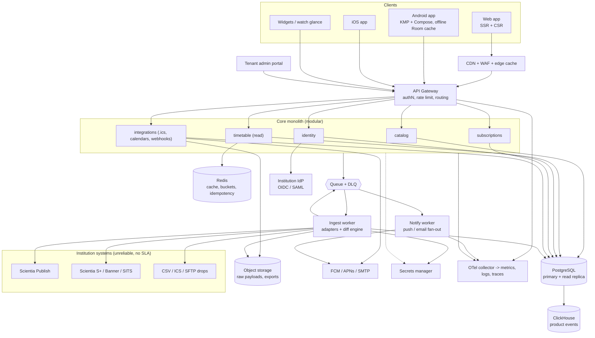
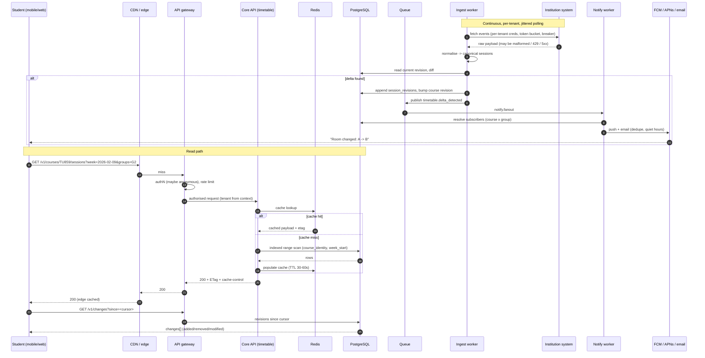
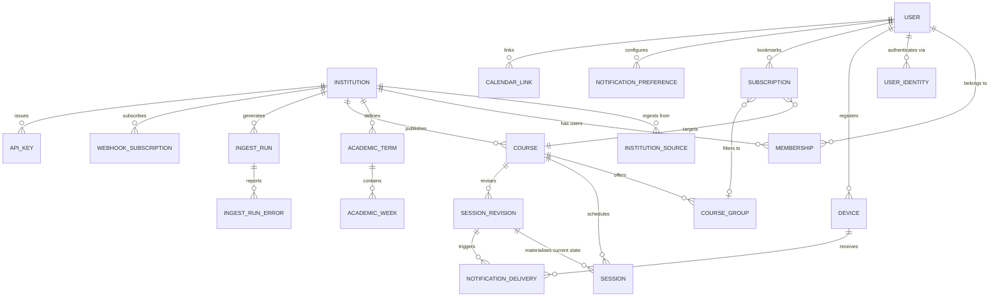

# CourseGrid — Technical Specification

**A production web + mobile SaaS for higher-education timetable intelligence**

| Field | Value |
|---|---|
| Document ID | `CG-SPEC-001` |
| Version | 1.0 (draft for engineering + product review) |
| Status | Proposed target architecture — **not** a description of shipped code |
| Subject app | CourseGrid (production evolution of the in-repo `TimetableScraper` / "TimeTable" Android prototype) |
| Companion document | [`docs/technical-architecture-specification.md`](technical-architecture-specification.md) — the **as-built** description of the existing Android prototype |
| Audience | Engineering, product, security, and SRE stakeholders |
| Repo grounding | All "confirmed" statements cite the prototype at `/Users/izzeddinhammad/AndroidStudioProjects/TimetableScraper` (v1.22, `versionCode` 22) |

---

## 0. How to read this document

### 0.1 Claim labels

Every substantive statement is labelled so that estimates are never mistaken for measurements and recommendations are never mistaken for commitments.

| Label | Meaning |
|---|---|
| **[CONF]** Confirmed | Verified from the existing prototype source or its artefacts (cited `file:line`). This is real, today. |
| **[REQ]** Requirement | Non-negotiable for a production launch of the described product. Absence is a launch blocker. |
| **[REC]** Recommendation | Engineering-justified design choice. Alternatives exist and are discussed; deviation is allowed with a recorded decision. |
| **[ASM]** Assumption | Unverified input to this specification. If wrong, the §13 "validate before implementation" list says what changes. |
| **[EST]** Estimate | Target range or modelled figure. **Not measured production data.** §8.6 states how to measure the real value. |
| **[MEASURED]** | Actual recorded figure. In this document there is exactly one source of these — prototype README self-reports, which are *claims*, not independent benchmarks. Labelled explicitly as such where used. |

### 0.2 What the existing prototype is (one paragraph)

**[CONF]** The repo contains a **single-module Android app** (`namespace com.example.timetablescraper`, `app/build.gradle.kts:9`) that talks **directly** to the TU Dublin Scientia Publish API with a static `Authorization: Anonymous` header (`api/TimetableApiService.kt:50`), caches per-week results in Room (`api/cache/TimetableDatabase.kt`, schema v7), refreshes via WorkManager (`worker/TimetableSyncWorker.kt`), detects timetable diffs (`api/TimetableRepository.kt:220-296`), and self-updates by polling the GitHub Contents API and firing an `ACTION_VIEW` APK install intent (`update/UpdateChecker.kt:31-38`, `update/UpdateManager.kt:94-116`). There is **no backend, no accounts, no CI, no signing config, and R8 is disabled** (`app/build.gradle.kts:26-32`; no `.github/`, no `*.yml`). It is an explicitly labelled prototype that supports **one** institution ([`README.md`](../README.md)).

The gap between that and the product in this document is the subject of **Appendix A**.

---

## 1. Assumptions

The request that produced this document specified no app name, domain, platform, or feature list. The following assumptions were therefore made. **[ASM]** markers repeat inline where a design decision depends on one.

| # | Assumption | Consequence if wrong |
|---|---|---|
| A1 | **Product shape:** a multi-tenant SaaS delivered as a responsive web app + native mobile apps (Android and iOS), with a public API. | If desktop-only or mobile-only, §3 loses the web tier and §4's client choices halve. Architecture core (ingest + core API + data) is unchanged. |
| A2 | **Domain:** the product is *schedule intelligence for higher education* — course timetables, room/lecturer changes, personal agendas, calendar sync. Chosen because the repo is a timetable app and grounding the spec in real domain facts makes it technically checkable rather than generic. | A different domain changes §5 entity names and §6 resources, but not the architecture, stack, or SLO structure. |
| A3 | **Tenant model:** the **institution is the tenant** and the paying customer; students/lecturers are free end users (B2B2C freemium with institutional seats). | If tenants were individual students, §5's `institutions` root and §7's tenant-isolation controls collapse into per-user rows; pricing/limits in §9 change. |
| A4 | **Data sources:** timetables originate from **institution systems** (Scientia Publish / Syllabus Plus in the prototype; also Ellucian, Tribal, and bespoke CSV/ICS feeds) obtained through **institution-authorised** integration, not unlicensed scraping. | **[REQ]** If ingestion is unlicensed scraping, the product is not launchable: see §7.8 (legal) and decision **D-2**. |
| A5 | **Primary market:** Ireland/EU first (the prototype is TU Dublin), then UK, then global. **GDPR applies**; EU data residency is the default. | If US-first, data residency moves to `us-east-1`, HIPAA/FERPA analysis replaces GDPR in §7.8. |
| A6 | **Cloud:** single public cloud, EU region primary (`eu-west-1`-equivalent), warm standby in a second EU AZ-set; managed services preferred over self-run. | On-prem/sovereign-cloud requirements change §3.5 and §9.3 only. |
| A7 | **Upstream reality:** Scientia Publish's API is **undocumented, has no published SLA, uses anonymous auth, and returns malformed HTML/XML on some error paths** ([CONF]: `api/TimetableParser.kt` wraps every parse in try/catch and maps malformed bodies to `TimetableApiException(502)`). Rate limits are unknown to us. | **[REQ]** The adapter layer must be defensive and independently rate-limited regardless; this assumption only affects how conservative the defaults are (§6.7). |
| A8 | **Scale:** 50–500 institutions, 0.3–5 M end users, 5–60 M sessions records (see §9.1). Figures are **[EST]**. | Scaling strategy in §9.2 is level-triggered; the concrete numbers, not the strategy, change. |
| A9 | **Compliance:** GDPR is a requirement; SOC 2 Type II and ISO 27001 are post-MVP goals. No PCI scope (no card data touches CourseGrid — payments via a PSP). | If card data is in scope, §7 gains PCI DSS controls and §5 gains tokenisation rules. |
| A10 | **Language:** English-only at MVP, with i18n architecture in place from day one (§2.5). | Adds locale-specific content (room names, date formats) work in §5.7. |
| A11 | **Team:** a team of 6–9 exists or will exist (§12.5). A solo maintainer cannot ship this spec's MVP. | If solo, MVP scope must shrink to the "MVP-minimal" column in §12.1. |
| A12 | **Monetisation:** annual institutional subscription + optional per-seat overage. Analytics is product-internal only; **no third-party ad tech, no data resale**. | **[REQ]** This is a privacy-positioning constraint, and it conflicts with the prototype's stated zero-telemetry posture (see decision **D-6**). |

---

## 2. Executive summary

### 2.1 App name and value proposition

**CourseGrid** turns a university's published timetable into a personalised, always-current schedule — "your timetable is right, on every device, the moment it changes."

### 2.2 Target users and primary use cases

| User | Primary use cases |
|---|---|
| **Student** (primary volume) | Find my course; see this week / this semester; get notified when a room or time changes; sync to Google/Outlook calendar; check what's on today from a widget/lock screen. |
| **Class representative / course officer** | Track changes affecting a whole cohort; share a group's schedule. |
| **Lecturer** | See own teaching schedule; see room allocations; be alerted to clashes. |
| **Institution timetabling officer** *(tenant admin)* | Publish/verify the feed; see ingestion health; correct mappings; see adoption metrics. |
| **Institution IT / security** *(tenant admin)* | Manage SSO, review access, export audit logs, verify data-handling terms. |
| **Third-party developer** *(post-MVP)* | Build on the public API: student portals, LMS widgets, digital signage. |

### 2.3 Core problems solved

1. **Wrong schedule, quietly.** Published timetables change after term starts (room swaps, cancellations, added sessions) and the official systems notify nobody. **[CONF]** The prototype's change-detection diff (`api/TimetableRepository.kt:220-296`, `ChangeType.{ADDED,REMOVED,MODIFIED}`) exists precisely because this is the pain point.
2. **The "who is my group?" problem.** A course has multiple subgroups (A/B/G1/G2) and a student belongs to one. **[CONF]** The prototype supports 24-hour-limited pull-to-refresh, group filtering, `⭐ default group pinning`, and subgroup sub-filtering ([`README.md`](../README.md)).
3. **Offline and unreliable networks.** Campus WiFi and lecture-hall signal are poor. **[CONF]** Room-backed offline cache + stale-while-revalidate at ~5 ms render are implemented and self-reported measured ([`README.md`](../README.md) — treat as a *claim*, not independent telemetry).
4. **Fragmentation across institutions.** Every institution exposes timetable data differently. CourseGrid normalises it once, so clients and integrations build against one API.
5. **Manual re-entry.** Students hand-copy schedules into personal calendars; CourseGrid provides one-tap calendar sync and a stable subscription URL.

### 2.4 Main differentiators

| Differentiator | Why it is defensible |
|---|---|
| **Change-first, not calendar-first** | The product's core loop is *detect and notify deltas* — the prototype already computes field-level diffs ("Room: A → B"). Competitors render static schedules. |
| **Institution-authorised multi-source ingestion** | A maintained normalisation layer across Scientia/other vendors + institutional agreements is slow to replicate and is the moat. |
| **Offline-first mobile** | **[CONF]** Already the prototype's design (Room cache, stale-while-revalidate, 24 h pull-refresh cooldown, fail-safe offline banner). Works in a basement lecture theatre. |
| **Privacy as a feature** | **[CONF]** `PRIVACY.md` states zero analytics/crash-report collection today; the production product keeps this stance for students at the cost of moving analytics server-side and pseudonymised (decision **D-6**). |
| **Group-aware model** | Subgroup membership is a first-class entity, not a text field, so "my timetable" is correct per student. |

### 2.5 Product description

#### 2.5.1 Key features

**MVP**
- Institution/client selection and course search (debounced, ranked, cached) — **[CONF]** prototype pattern: `SearchScreen.kt` with debounced query and stale-response discard.
- Personal timetable: term/week/day navigation, group filtering, pinned default group.
- **Change detection and notification**: server-computed deltas fanned out via push + email digest.
- Offline cache with visible freshness state ("Cached · updated 12 min ago").
- Calendar export/subscription (.ics, webcal) and Google/Outlook one-tap connect.
- Account + SSO (institution IdP) with anonymous-read grace path so the app is useful before sign-in.
- Web app with the same data contract as mobile.

**Post-MVP**
- Room/lecturer lookup and free-room finder.
- Cross-institution (multi-campus / consortium) accounts.
- Public REST API + webhooks for integrators; LMS (Moodle/Canvas) and digital-signage embeds.
- Attendance/clash analytics for timetabling officers; "attendance intent" without location tracking.
- iOS parity, widgets, Wear OS / watchOS glance, live activities.

#### 2.5.2 Primary user journeys

**J1 — First run to personalised week** (student, mobile)
`Install → pick institution (or deep link) → search course "TU859" → select course → select subgroup G2 → "This week" renders from cache in <1 s → background ingest confirms → banner clears → prompted to pin as home`.

**J2 — Change notification** (student, any device)
`Ingest job detects field-level delta → delta persisted with revision → fan-out job resolves affected subscribers (course × group) → push to registered devices + email digest if opted in → user opens deep link → "3 changes this week" sheet → accepts calendar update`.
**[CONF]** Prototype analogue: `AlertDialog` listing added 🟢 / removed 🔴 / modified 🟡 sessions, matched on `(module_code, start, end)` (`api/TimetableRepository.kt:220-296`).

**J3 — Web quick check** (student, desktop, unauthenticated)
`Search engine/short link → /i/tudublin/c/TU859 → server-rendered current week (SEO-indexed, no login) → "get alerts" → SSO`.

**J4 — Tenant onboarding and feed health** (institution admin)
`Admin invited → SSO → connect timetable system (endpoint + credentials) → mapping wizard (term dates, weeks, group taxonomy) → dry-run ingest with diff preview → publish → dashboard shows per-course freshness, error rate, adoption`.

**J5 — Degraded network** (student, offline)
`App opens → renders cached week instantly → "⚠️ Offline / Cached Mode" banner → pull-to-refresh throttled → auto-retry on connectivity → reconciles silently`.
**[CONF]** Both the banner and the cooldown exist in the prototype.

#### 2.5.3 User roles and permissions

| Role | Scope | Read | Write | Admin |
|---|---|---|---|---|
| `anonymous` | none | public course/timetable read (rate-limited) | – | – |
| `end_user` (student/lecturer) | self | tenant public data + own subscriptions | own courses, groups, devices, notification prefs | – |
| `tenant_admin` | tenant | all tenant data + ingestion health | institution config, mappings, publish/unpublish, user roles | tenant users, tenant audit log |
| `tenant_viewer` | tenant | tenant data + dashboards | – | – |
| `platform_operator` (CourseGrid staff) | cross-tenant | metadata + health; **no** end-user PII by default | ops actions | break-glass, audited (see §7.6) |
| `service_account` (integration) | tenant or platform | scoped API read | webhook config, ingest trigger | – |

**[REQ]** Authorisation is enforced server-side at the resource level (not by hiding UI), expressed as a policy layer (§7.2), with a deny-by-default rule for any tenant-scoped resource not explicitly granted.

#### 2.5.4 Functional requirements (selection, MVP)

| ID | Requirement | Priority |
|---|---|---|
| F-1 | Read a course's sessions for a date range, filtered by group, term, and `updated_since`. | Must |
| F-2 | Subscribe to (bookmark, pin) courses with a default group per course. | Must |
| F-3 | Detect and store field-level session deltas with a monotonic revision per course. | Must |
| F-4 | Notify affected subscribers of deltas via push and/or email, respecting per-user opt-outs and quiet hours. | Must |
| F-5 | Serve identical data semantics to web and mobile from one versioned contract. | Must |
| F-6 | Provide offline read with an explicit freshness indicator. | Must |
| F-7 | Export/subscribe .ics per course/group/personal agenda. | Must |
| F-8 | Tenant admin: configure data sources, run dry-run ingest, view freshness/error dashboards. | Must |
| F-9 | SSO via institution IdP (OIDC/SAML); optional local account for non-SSO institutions. | Must |
| F-10 | Full-text course search with typo tolerance, ranked, debounced, cacheable. | Should |
| F-11 | Public API + webhooks for deltas. | Should (post-MVP) |
| F-12 | Free-room finder and room booking hand-off. | Could |
| F-13 | Clash detection across a user's own subscriptions. | Should |
| F-14 | Attendance analytics for officers (aggregate, k-anonymised). | Could |

#### 2.5.5 Non-functional requirements

| Area | Requirement |
|---|---|
| Availability | **[EST]** 99.9 % monthly for the read API at MVP; 99.95 % target by phase 3 (§8.1). |
| Latency | **[EST]** p95 ≤ 150 ms (server) for cached session reads; p99 ≤ 500 ms (§8.1). |
| Freshness | **[EST]** p95 ≤ 30 min from upstream publication to client notification (§8.1). |
| Durability | **[REQ]** No user-created data loss: subscriptions, prefs, devices, audit log are backed up with RPO ≤ 15 min (§9.4). |
| Scalability | **[REQ]** Horizontal scale to the §9.1 growth model with no architectural change. |
| Accessibility | **[REQ]** WCAG 2.2 AA on web; platform a11y APIs on mobile (§2.5.6). |
| Privacy | **[REQ]** GDPR-compliant, data minimisation, no third-party ad tech, no PII in logs (§5.7). |
| Security | **[REQ]** OWASP ASVS L2 for the API/web, MASVS L2 for mobile (§7.2). |
| Portability | **[REC]** Containerised, IaC-managed, no undisclosed manual cloud state (§10.3). |
| Observability | **[REQ]** Every request traceable end-to-end; SLOs and error budgets defined (§10.4). |
| Cost | **[REC]** Unit economics visible per tenant: ingest cost, storage cost, notification cost (§9.6). |

#### 2.5.6 Accessibility, localization, cross-platform

**Accessibility [REQ]** — WCAG 2.2 AA: keyboard-complete navigation, visible focus, ≥4.5:1 contrast for text (3:1 for large/UI), no colour-only encoding (the prototype's 🟢/🔴/🟡 diff markers must carry text labels too), timetable grids must expose a screen-reader-usable *list* view (a table grid is not an accessible default), `prefers-reduced-motion` honoured for the week-transition animations, dynamic type up to 200 % without clipping. Mobile: TalkBack and VoiceOver passes, 48×48 dp minimum targets, `contentDescription` on every icon-only control. **[REC]** Automate with axe-core + Playwright on web, Espresso/Compose a11y checks + manual TalkBack script on Android, XCUITest + Accessibility Inspector on iOS; make a11y part of the PR gate (§11.7).

**Localization [REQ architecture / REC rollout]** — ICU MessageFormat for all strings, no concatenation; `Intl`/platform formatters for dates, times, week numbering (ISO-8601 week numbering is the default and configurable per tenant — this matters: institutions disagree about what "Week 1" means, and the prototype pins it with `first_week_monday` in `SyncPreferences.kt:209-249`); IANA `tzdata` timezone handling with the *institution's* timezone as the source of truth for session times and the *user's* timezone for agenda display; pseudo-localisation in CI; RTL layout support verified.

**Cross-platform [REC]** — one canonical data contract, versioned, consumed by all clients; a shared TypeScript client SDK generated from the OpenAPI document so web, mobile (RN), and integrators cannot drift; platform-specific shells for the things web cannot do (push, widgets, background refresh, calendar write).

---
## 3. System architecture

### 3.1 Recommended architecture style, and why

**[REC] Modular monolith for the core domain + separately deployable ingest workers + an edge cache. Event-driven on the delta path; request/response on the read path.**

Why not the alternatives:

| Option | Verdict | Reasoning |
|---|---|---|
| **Modular monolith + dedicated workers + edge cache** | **Chosen** | The dominant workload is *read-heavy, cacheable, and one bounded context* (timetables). Independent scaling is only needed for **ingest** (bursty, upstream-rate-limited, failure-isolated) and **fan-out** (notifications). Everything else benefits from one transaction boundary, one deploy, one schema. Consistent with a 6–9 person team (§12.5): microservices would spend the team's budget on distributed-systems plumbing instead of the moat (ingestion coverage + change detection). |
| Microservices per resource | Rejected *now* | Buys independent scaling we don't need for reads, at the cost of distributed transactions across `course → session → subscription → notification`. Revisit when ≥3 teams own distinct contexts — the modular boundaries below are chosen so extraction stays cheap. |
| Serverless-first (functions + managed data) | Partially adopted | Excellent fit for ingest cron, webhook fan-out, and image/asset pipelines (§4.6). Poor fit for the hot read API where per-request cold starts and connection storms hurt p95. |
| Server-rendered monolith only (no API) | Rejected | Native mobile is a first-class client (§0.1 A1); a shared versioned API is required. |
| Event-sourced core | Rejected for entities, adopted for deltas | Full event sourcing on timetable data costs complexity without a business need. **Session deltas are the exception**: they are naturally append-only revisions and the product *is* the delta stream (§3.8, `session_revisions`). |

**Module boundaries inside the monolith** (each a package with its own schema, no cross-module table access; extraction candidates flagged ⤴):

| Module | Owns | Extraction trigger |
|---|---|---|
| `catalog` | institutions, programmes, courses, groups | – |
| `timetable` | terms, weeks, sessions, session_revisions, read API | read volume >5k rps sustained |
| `identity` | users, IdPs, sessions, devices, roles | compliance-driven split |
| `subscriptions` | user ↔ course/group, preferences, quiet hours | – |
| `notify` ⤴ | fan-out, templates, delivery log, push tokens | always separate worker (§3.1) |
| `ingest` ⤴ | source adapters, fetch runs, normalisation, diffing | always separate worker (§3.1) |
| `admin` | tenant config, mappings, dry-run, dashboards | – |
| `analytics` ⤴ | event collection, aggregates | separate OLAP store from MVP (§3.2) |
| `integrations` | .ics, calendar OAuth, webhooks, LMS embeds | – |

### 3.2 Component inventory

**Web client [REC]** — Next.js (App Router) SSR/ISR for indexable public timetable pages (J3) plus a client-side app shell for authenticated views. Rationale: SEO matters for student acquisition ("TU859 timetable"), and server rendering lets the CDN absorb anonymous read traffic. **Alternative:** SPA (Vite + React Router) — simpler, cheaper, but loses SEO and forces every anonymous visit onto the API. Trade-off: SSR adds a Node runtime to operate.

**Mobile client [REC]** — Kotlin Multiplatform + Compose Multiplatform, or React Native, for one shared domain/model layer across Android and iOS. Migration path for the existing prototype: keep the Compose UI and Kotlin domain models **[CONF]** (`ui/screens/*`, `api/Models.kt`), replace the direct-to-Scientia `TimetableApiService` with a CourseGrid API client, and keep the Room layer as the offline cache (add a delta-sync table). **Alternative:** two native apps (Swift + Kotlin) — best platform fidelity, ~1.6× client cost. Trade-off documented in §4.2.

**Backend [REC]** — TypeScript (NestJS/Fastify) or Kotlin (Ktor/Spring Boot) modular monolith. Recommendation: **TypeScript** for web/API velocity and shared types with the client SDK; **Kotlin** is the better choice if the team already knows Kotlin from the prototype (A11) and wants one language across backend + Android. This is decision **D-1** in §13 and should be settled before MVP code starts, because it is expensive to reverse.

**API surface [REC]** — one public REST/JSON API, versioned by URL path (`/v1`), OpenAPI 3.1 as the single source of truth generating the TS SDK and server stubs. Internal ingest worker → core communication via the same HTTP API or (if co-deployed) direct module calls; **not** a separate graph of RPCs. See §6.

**Primary database [REC]** — PostgreSQL 16+ managed. Timetable data is deeply relational (institution → programme → course → group → session) and needs real constraints, partial indexes, and transactional ingest. **Alternatives:** MySQL (weaker partial-index/JSON ergonomics), DynamoDB (poor fit for the ad-hoc date-range + group filters and for referential integrity; would push complexity into the app). Trade-off: Postgres needs capacity planning for read replicas rather than "infinite" managed scaling.

**Cache [REC]** — Redis (managed, e.g. ElastiCache/Memorystore) for: read-through caching of `GET /v1/courses/{id}/sessions`, per-instance ingest token buckets, idempotency-key records, and notification dedupe. Redis is **not** the source of truth for anything: a cold cache must degrade to a slower-but-correct Postgres read. **[CONF]** The prototype's in-process token bucket (5 requests / 10 s, per `X-Course-Identity`, `api/RateLimitInterceptor.kt:24-102`) and singleton request debouncer (`api/RequestDebouncer.kt`) are the single-node version of this; in the SaaS the bucket moves to Redis so limits hold across pods.

**Queue / broker [REC]** — Managed queue with at-least-once delivery and dead-letter support (SQS+DLQ, or Redis Streams for lower SVOL ops if Redis is already in play). Used for: ingest fan-out, delta fan-out, notification delivery, .ics regeneration, analytics events. **Alternative:** Kafka — justified only once there are multiple independent consumers with replay needs; at MVP it is operational overhead without payoff. Keep the event payloads Kafka-portable (schema-versioned JSON/Avro, keyed by `tenant_id`).

**Object storage [REC]** — S3-compatible bucket for: raw upstream payloads (immutable, for audit and replay), exported .ics/CSV snapshots, generated PDF timetable sheets, tenant branding assets. Lifecycle: hot 30 days → infrequent access 12 months → delete (or glacier if a contractual retention clause requires it). Raw payload retention is the audit backbone for "what did the source actually say?" disputes.

**Search [REC]** — PostgreSQL full-text (`tsvector` + `pg_trgm`) for course search at MVP; **OpenSearch** only when fuzzy cross-field ranking, multi-language stemming, or >5 M documents demand it. **[CONF]** The prototype's search is a debounced remote call (`SearchScreen.kt`) with stale-response discarding — server-side search plus a CDN-cacheable results endpoint is strictly better (cheaper, typed, cacheable, and typo-tolerant via trigrams).

**Analytics [REC]** — Two tiers: (1) **operational** metrics in Prometheus/Grafana or the APM vendor (§10.4); (2) **product/usage** analytics in a columnar store (ClickHouse) fed from the event queue. Deliberately **no client-side third-party ad/analytics SDK** (A12, D-6) — events are emitted by the server from access logs and explicit product events. Trade-off: no client-side funnels (autofill, form abandonment) without a first-party client event pipeline.

**Third-party integrations [REC]** — Institution IdPs (OIDC/SAML — Entra ID, Google Workspace, Shibboleth/Edugate for EU HE), calendar providers (Google Calendar, Microsoft Graph), push (FCM/APNs), email (transactional provider with EU region + SPF/DKIM/DMARC), payments (PSP; no card data on CourseGrid), error tracking (Sentry EU, self-hostable), and — critically — **the timetable source adapters**:

| Adapter | Mechanism | Notes |
|---|---|---|
| **Scientia Publish** (prototype's source) | Authenticated HTTP JSON, anonymous header today | **[CONF]** Two operations only: `POST {base}/CategoryTypes/{programmeTypeId}/Categories/FilterWithCache/{institutionId}?query=&pageNumber=1` (search, `api/TimetableApiService.kt:128-135`) and `POST {base}/CategoryTypes/Categories/Events/Filter/{institutionId}?startRange=&endRange=` (events, `:137-142`). Auth is a static `Authorization: Anonymous` header (`:50`) with per-institution `institutionId` and `programmeTypeId` — i.e. the *tenant configuration* is already modelled in code (`api/InstitutionConfiguration.kt:15-68`, `api/Institution.kt:13-56`) and must become DB-driven (§5.2 `institutions`). |
| Scientia timetabling (S+) direct | Vendor API/SDK or DB read via institution | Higher fidelity, requires contract |
| Ellucian Banner/Colleague | Vendor API or extract | Common in US |
| Tribal SITS / CMIS | Extract or vendor API | Common in UK |
| CSV/ICS/XLSX drop | Scheduled file pickup from tenant SFTP or admin upload | The escape hatch for bespoke systems; needs validation + mapping UI |
| Manual admin entry | Admin UI | Fallback for small institutions; must be audited |

### 3.3 Logical component architecture

```
                        ┌──────────────────────────── Clients ────────────────────────────┐
                        │  Web (SSR+CSR)      Android (KMP/Compose)      iOS       Widgets │
                        │      │                     │                      │            │
                        │      └──── shared generated TS/Kotlin SDK (OpenAPI 3.1) ────────┘
                        └──────┬─────────────────────┬──────────────────────┬────────────┘
                               │ HTTPS               │ push (FCM/APNs)
                               ▼                     │
                    ┌──────────────────┐             │
                    │  CDN + WAF +     │             │
                    │  Edge cache      │             │
                    └────────┬─────────┘             │
                             ▼                       │
        ┌────────────────────────────────────────────────────────────────┐
        │             API Gateway  (authN, rate limit, routing)          │
        └───────┬───────────────────────────────┬────────────────────────┘
                │                               │
                ▼                               ▼
   ┌────────────────────────┐        ┌────────────────────────┐
   │  Core monolith         │        │  Admin / tenant portal │
   │  ├ catalog             │◄──────►│  (config, dry-run,     │
   │  ├ timetable (read)    │        │   freshness dashboards)│
   │  ├ identity            │        └────────────────────────┘
   │  ├ subscriptions       │
   │  ├ integrations        │◄──────── .ics, calendar OAuth, webhooks
   │  └ analytics emitter   │
   └───┬────────┬───────┬───┘
       │        │       │
       │        │       └──────────────► Redis (read cache, token buckets,
       │        │                         idempotency, dedupe)
       │        └──────────────────────► Object storage (raw payloads,
       │                                   exports, branding assets)
       ▼
 ┌───────────────┐        ┌──────────────────┐        ┌────────────────────┐
 │ PostgreSQL    │        │  Queue + DLQ     │        │  ClickHouse        │
 │ (primary +    │        │  (ingest, delta, │        │  (product events,  │
 │  read replica)│        │   notify, events)│        │   aggregates)      │
 └───────────────┘        └───┬──────────┬───┘        └────────────────────┘
                              │          │
              ┌───────────────┘          └────────────────┐
              ▼                                           ▼
   ┌────────────────────────┐                  ┌────────────────────────┐
   │  Ingest worker         │                  │  Notify worker         │
   │  - per-tenant schedule │                  │  - subscriber fan-out  │
   │  - source adapters     │                  │  - push/email/SMS      │
   │  - normalise + diff    │                  │  - quiet hours, dedupe │
   │  - writes revisions    │                  │  - delivery log        │
   └───────────┬────────────┘                  └────────────────────────┘
               │ outbound (per-tenant credentials, jittered,
               │ conservative token bucket, circuit breaker)
               ▼
   ┌─────────────────────────────────────────────────────────────┐
   │  Institution systems: Scientia Publish / S+ / Banner / SITS │
   │  / SFTP drops  —  unreliable, undocumented, no SLA          │
   └─────────────────────────────────────────────────────────────┘
   ┌─────────────────────────────────────────────────────────────┐
   │  Cross-cutting: IdP (OIDC/SAML) · Secrets manager ·         │
   │  OTel collector · Audit log sink · Feature flags            │
   └─────────────────────────────────────────────────────────────┘
```

### 3.4 High-level architecture (Mermaid)



### 3.5 Physical deployment architecture

**[REC]** Containers on a managed orchestrator (Kubernetes or a managed container platform with autoscaling), two or more availability zones, one region primary + warm standby (§9.4). Composition:

| Tier | Deployment | Scaling unit | Notes |
|---|---|---|---|
| Edge | CDN + WAF + edge cache (anonymous GET / public pages, .ics files) | global PoPs | Absorbs the student read storm; challenge/block bots here (§7.7) |
| API/core | 3+ pods, HPA on CPU *and* p95 latency | pod | Stateless; only external state is PG/Redis/object storage |
| Read API | same image, `read` role flag, scaled separately | pod | Optional at MVP; enables read replica routing without a code fork |
| Ingest workers | 2+ pods, queue-driven, `maxConcurrency` per tenant | pod × tenant shard | **Never** autoscaled by queue depth without a per-upstream cap: the bottleneck is upstream rate limits, not our CPU |
| Notify workers | 2+ pods, queue-driven | pod | Idempotent; dedupe in Redis |
| Tenant admin | same image, separate ingress + stricter WAF + SSO required | pod | Separate ingress so a tenant-admin attack surface is not the student surface |
| Postgres | managed, Multi-AZ, one primary + 1–2 read replicas, PITR on | instance class | §9.2 vertical thresholds |
| Redis | managed, Multi-AZ, replication, no persistence requirement (cache only) | instance class | Sized by working set, not by dataset |
| Queue | managed, DLQ per consumer, visibility timeout ≥ p99 handler time | n/a | Alarm on DLQ depth > 0 |
| ClickHouse | managed/single node with replication | instance | Async consumer only; never on the request path |
| Secrets | managed secrets manager, per-environment, per-tenant values | n/a | §7.4 |

Preview/staging/prod parity is required (§10.1); local dev runs the same images with Docker Compose.
**[CONF]** Today there is *no* deployment architecture at all beyond the Play/GitHub-download APK — no CI, no signing config, no server. Appendix A lists this as the largest single gap.

### 3.6 Data flow between major components

**Read path (cached, hot)**
`Client → CDN (hit, TTL 30–60 s + stale-while-revalidate) → [miss] API Gateway (authN, rate limit) → timetable module → Redis (hit) → [miss] Postgres (read replica, indexed range scan) → response with ETag → CDN stores`.
**[CONF]** Client-side analogue in the prototype: Room read first, then network with a diff — `api/TimetableRepository.kt:114-130` returns `CACHE_FRESH` with zero network calls when age < TTL. The SaaS keeps the same three sources but names them `edge → redis → postgres`, and keeps the same three response states (`fresh`, `stale`, `network`) semantics for clients.

**Ingest path (write)**
`Scheduler (per tenant, jittered) → enqueue ingest.run{tenant, course_scope} → Ingest worker: fetch upstream (token bucket + circuit breaker, per-tenant credentials from secrets manager) → store raw payload to object storage → normalise to canonical sessions → diff against current revision → if delta: write session_revisions + bump course revision, enqueue delta.detected → enqueue notify.fanout{revision} → notify worker resolves subscribers (course × group) → dedupe → push/email → delivery log`.
**[CONF]** The prototype's full-year classification trick is worth preserving: one request classifies all 30 academic weeks instead of 60 serial scans ([`README.md`](../README.md)) — i.e. **prefer one wide fetch over many narrow fetches** when the upstream permits it, because upstream rate limits, not our compute, are the constraint. The prototype's exact pattern is `fetchFullYearTimetable()` over the Sep–Apr range, cached per course in `SharedPreferences` (`active_weeks_<id>`).

**Delta path (product core)**
`delta.detected → session_revisions row (append-only, monotonic per course) → notify.fanout → per-user channels → client fetches /v1/changes?since=<cursor> on next open (and receives push in between)`.
**[CONF]** Diff semantics already defined in the prototype and adopted unchanged: match key `(module_code, start, end)`; classify `ADDED` / `REMOVED` / `MODIFIED`; field-level descriptions ("Room: A → B") for Room/Lecturer/Group/Type (`api/TimetableRepository.kt:220-296`).

### 3.7 Authentication, authorization, sessions, identity providers

**[REQ]**
- **Identity:** institution IdP via **OIDC** (preferred) or **SAML 2.0** (legacy HE), brokered by the platform so the same user identity works across tenants. Guest/anonymous read remains available for public timetable pages and course search (J3) — this is a product requirement, and it is also the biggest abuse surface (§7.7).
- **Accounts:** CourseGrid owns a `users` row keyed by verified email + optional `user_identities` rows per IdP subject. **Never** store institution passwords. Local password auth only for institutions without SSO, then hashed with **Argon2id** (fallback bcrypt cost ≥12, per OWASP).
- **Session model:** web = short-lived access token (10–15 min) + rotating refresh token in an `HttpOnly`, `Secure`, `SameSite=Lax` cookie, with refresh-token rotation and reuse detection. Mobile = OAuth 2.1 authorization code + PKCE, tokens in platform keystore/Keychain, **never** in shared prefs. **[CONF]** The prototype has no accounts at all — sync/star state lives in `SharedPreferences` (`SyncPreferences.kt`), so there is no token risk *today* and no identity to migrate; this is a greenfield build, not a retrofit.
- **Authorization:** RBAC (§2.5.3) + resource scoping, expressed centrally (one policy module, `can(actor, action, resource)`), deny-by-default, and **tenant id derived from the authenticated context, never from a request parameter**. Cross-tenant access attempts are logged as security events, not just 403s.
- **Session security:** absolute + idle timeouts, device list with per-device revoke, forced re-auth for tenant-admin actions, MFA required for all `tenant_admin` and `platform_operator` roles.

### 3.8 Synchronous vs asynchronous processing

| Path | Mode | Reason |
|---|---|---|
| Course search, session read, agenda read, user prefs write, device registration | **Sync (HTTP)** | User is waiting; ≤150 ms p95 achievable from cache/DB |
| SSO callback, token refresh | Sync | Protocol-bound |
| Ingest fetch + normalise + diff | **Async (queue)** | Long, flaky, upstream-limited, retryable, must not hold a request |
| Delta fan-out, push/email delivery | Async | Fan-out width unknown (1–50 k subscribers), needs retries and DLQ |
| .ics generation for large agendas | Async, with fast sync path for small ones | Avoid request-path work on big files |
| Raw payload archival, analytics collection | Async, fire-and-forget with DLQ | Never block the user |
| Audit log write | **Sync on the request path, or same-transaction outbox** | Missing audit rows for security actions is unacceptable; use the transactional-outbox pattern so audit and business writes commit atomically |
| Payment/webhook callbacks to tenants | Async with retries + HMAC signature | Third-party availability must not affect us |

**[REQ] Idempotency everywhere on the write path.** Ingest runs are keyed `(tenant, course, revision_hash)`; notification delivery is keyed `(user, revision, channel)`; queue consumers tolerate redelivery. **[CONF]** The prototype already dodges duplicate upstream calls with a debouncer keyed `POST|timetable|{institutionId}|{categoryTypeId}|{identity}|{yyyy-MM-dd}` (`api/TimetableApiService.kt:184-189`) — the same key shape, hoisted to Redis, becomes the ingest dedupe key.

### 3.9 Event-driven workflows

| Event | Producer | Consumers | Payload (key fields) |
|---|---|---|---|
| `institution.sync_requested` | Scheduler / admin "sync now" | ingest worker | `tenant_id, course_scope, reason, requested_by` |
| `ingest.run_completed` | ingest worker | admin dashboards, analytics, alerting | `tenant_id, run_id, courses_seen, deltas, duration_ms, errors[]` |
| `timetable.delta_detected` | ingest worker | notify worker, webhook dispatcher, analytics | `tenant_id, course_identity, revision, changes[]` |
| `notify.fanout` | notify worker | push provider, email provider | `revision, recipient_ids[], channel` |
| `user.subscription_changed` | core API | notify worker (recompute interests), analytics | `user_id, op, course_identity, group` |
| `calendar.export_requested` | core API | integrations worker | `user_id, scope, format` |
| `tenant.config_changed` | admin portal | ingest worker (reschedule), cache invalidator | `tenant_id, changed_keys[]` |
| `audit.security_event` | authN/Z layer | audit sink, SIEM | `actor, action, resource, result, ip, ua` |

**[REQ]** Events are schema-versioned, carry `tenant_id` for partitioning, and are replayable from the object-storage archive for at least 90 days. Consumers must be idempotent. Poison messages land in a DLQ that pages, not a log nobody reads.

### 3.10 Primary request / data flow (Mermaid)



---
## 4. Technology stack

Selection criteria, in order: **(1)** proven at the scale in §9.1, **(2)** total cost of ownership for a 6–9 person team, **(3)** hiring pool, **(4)** exit cost if the choice is wrong. Every choice below has a funded escape route.

### 4.1 Frontend (web)

| Concern | [REC] Choice | Why | Alternatives & trade-offs |
|---|---|---|---|
| Framework | **Next.js 15 (App Router), React 19, TypeScript strict** | SSR/ISR gives indexable public timetable pages (J3) and lets the CDN absorb anonymous load; huge hiring pool; mature a11y tooling | **Vite + React SPA**: cheaper, no Node runtime — but loses SEO and forces all anonymous traffic to the API. **Remix/React Router 7**: great data-loading model, smaller ecosystem. **SvelteKit**: excellent DX/perf, much smaller hiring pool |
| Styling/UI | **Tailwind CSS + headless primitives (Radix/React Aria)** | React Aria ships WCAG-correct keyboard/focus/ARIA behaviour for free — directly serves the WCAG 2.2 AA requirement | **MUI/Chakra**: faster start, opinionated, harder to hit AA on custom grids. **CSS Modules**: no utility velocity |
| Data layer | **TanStack Query** + generated OpenAPI client | Caching, retries, stale-while-revalidate semantics map 1:1 onto our freshness model | **SWR**: similar, smaller feature set. **Apollo/GraphQL**: adds a second API paradigm (§6.1) |
| State | Local state + URL state; **no global store at MVP** | Timetable views are URL-addressable (institution/course/week/group) — shareable links are a feature and a debugging aid | **Zustand/Redux**: add only when genuinely cross-cutting client state appears |
| Quality gates | ESLint + Prettier, `tsc --noEmit`, Playwright, axe-core, Vitest | Standard, cheap, CI-fast | — |

### 4.2 Mobile client

| Concern | [REC] Choice | Why | Alternatives & trade-offs |
|---|---|---|---|
| Strategy | **Kotlin Multiplatform + Compose Multiplatform** (fallback: React Native + Expo) | Reuses the prototype's Kotlin domain model and Compose skills **[CONF]** (`api/Models.kt`, `ui/screens/*`), shares offline/persistence logic across Android+iOS, native performance for a grid-heavy UI | **React Native/Expo**: fastest to two platforms, shares TS with web, weaker for dense grids/60 fps lists, JS bridge overhead. **Two native apps (Swift + Kotlin)**: best fidelity, ≈1.6× cost. **PWA only**: cheapest, but iOS push/background refresh limits make change notifications unreliable — which is the product |
| Android baseline | **[CONF]** minSdk 26, target/compileSdk 36, Kotlin 2.2.10, Compose BOM 2026.02.01, Room 2.7.1, WorkManager 2.10.0, OkHttp 4.12.0 | Already in `gradle/libs.versions.toml` and `app/build.gradle.kts` — keep, it is current and correct | None material |
| Offline store | **Room** (keep) + a `delta_cursor` table and `session_revisions` mirror | **[CONF]** Room already caches per week with composite index `(courseIdentity, weekStart)` and a `fetchedAt` pruning index (`api/cache/CachedEventEntity.kt:15-18`) — the schema is sound; it needs delta sync, not replacement | **SQLDelight** (better KMP story), **Realm** (declining), **plain files** (no query power) |
| Background work | **WorkManager** with the existing strategy-aware scheduling **[CONF]** (`worker/TimetableSyncWorker.kt:51-86`), plus **FCM data messages** for server-pushed deltas | WorkManager is the only sanctioned Android periodic mechanism; FCM data messages replace the prototype's 2-minute UI poll | **Push-only**: battery-friendly but breaks without network/Google services. Push must remain an *optimisation*; the poll/delta cursor is the correctness path |
| HTTP/JSON | **Ktor client + kotlinx.serialization** (or keep OkHttp + **kotlinx.serialization**) | **[CONF]** The prototype hand-rolls `org.json` parsing (`api/TimetableParser.kt`) and pulls in Retrofit 2.11.0 that is *never used*. Replace both: typed models, no reflection, compile-time safety | **Retrofit + Moshi**: fine, but the codebase already has dead Retrofit weight; don't add a second unused stack |
| Calendar/widgets | Platform APIs; **Glance** for Android widgets | **[REC]** Widget = passive change surface, high retention  ||
| Distribution | **Play Console + Play App Signing**, **TestFlight/App Store**, staged rollout % | **[CONF]** The prototype instead polls the **GitHub Contents API** and fires an APK-install intent with `REQUEST_INSTALL_PACKAGES` (`update/UpdateChecker.kt:31-38`, `update/UpdateManager.kt:94-116`). **[REQ] Remove this** — it is an unauthenticated supply-chain path (§7.1, decision **D-3**) | Enterprise MDM/Managed Play for institution-deployed devices |

### 4.3 Backend, APIs

| Concern | [REC] Choice | Why | Alternatives & trade-offs |
|---|---|---|---|
| Language/runtime | **TypeScript on Node 22 LTS** *(or Kotlin/JVM 21 — decision **D-1**)* | TS: shared types with web + generated SDK, fastest iteration, largest pool. Kotlin: one language across backend and Android if the team is the prototype's author | Go: excellent ops profile, weaker shared-type story with web. Python: fastest prototyping, weakest for a high-concurrency typed API with a long life |
| Framework | **NestJS** (TS) or **Ktor** (Kotlin) | Both give DI, module boundaries (§3.1), validation pipes, OpenAPI generation, testability | **Fastify/Express**: less structure, more freedom, more drift. **Spring Boot**: heavyweight but very mature |
| API style | **REST + JSON, OpenAPI 3.1, URL versioning** | §6.1 | GraphQL: one round trip for agenda+changes, but adds N+1 and caching complexity we don't need. gRPC-web: no browser story; internal-only candidate |
| Validation | **Zod** (TS) / **kotlinx.serialization + explicit validators** at the boundary | Single schema used for validation, types, and OpenAPI — impossible to drift | Manual validation: guaranteed to drift |
| DI | Framework-native DI | **[CONF]** The prototype uses manual lazy singletons (`TimetableApplication.kt:24-74`), which is fine for one module and wrong at this scale | Manual wiring (rejected) |
| Jobs/queue | Managed queue + **a small worker framework** (BullMQ on Redis, or SQS consumers) | At-least-once, DLQ, visibility timeout, simple ops | Kafka (revisit at multi-consumer replay), Temporal (powerful durable workflows, another system to run — consider if ingest orchestration gets hairy) |
| Docs | OpenAPI 3.1 checked into the repo; Redocly/Scalar-rendered public reference | Contract-first, reviewable in PRs | Hand-written docs: always stale |

### 4.4 Data stores

| Concern | [REC] Choice | Why | Alternatives & trade-offs |
|---|---|---|---|
| OLTP | **PostgreSQL 16+ managed, Multi-AZ + read replicas + PITR** | Relational integrity for the domain; partial/GIN/trigram indexes; JSONB for adapter-specific raw fields; mature `EXPLAIN`/`pg_stat_statements` for §8.6 | MySQL: viable, weaker index/JSON ergonomics. Managed Postgres with vector support opens §12 semantic search later |
| Migrations | **Expand/contract, forward-only, versioned in-repo** (Prisma Migrate / Flyway / Atlas) | Zero-downtime deploys require expand → backfill → switch → contract | **[CONF] Ban `fallbackToDestructiveMigration()`** — it is currently enabled for all paths except `MIGRATION_6_7` (`api/cache/TimetableDatabase.kt:97`) and would silently wipe user data in production |
| Cache | **Redis 7 managed** | §3.2 | KeyDB/Dragonfly: faster, less managed support. Memcached: no data structures/dedupe |
| Search | **Postgres FTS + `pg_trgm`** → **OpenSearch** at >5 M docs or when ranking demands it | Avoids running a search cluster on day one | Elasticsearch: same class, licensing considerations. Typesense/Meilisearch: lovely DX, another store to operate |
| OLAP | **ClickHouse** | Columnar, cheap per event, great for tenant dashboards and "which courses changed most" | BigQuery/Snowflake: serverless, higher $/query at our volume. Postgres-only analytics: blocks the primary |
| Object storage | **S3-compatible with lifecycle rules + object-lock option** | Immutable raw payload archive is the ingestion audit trail | — |
| Client cache | Room (Android), SQLite/GRDB (iOS), IndexedDB via TanStack Query persister (web) | Offline-first is a product requirement (F-6) | — |

### 4.5 Infrastructure

| Concern | [REC] Choice | Why | Alternatives & trade-offs |
|---|---|---|---|
| Compute | **Containers on managed Kubernetes** (EKS/GKE) or a managed container platform | Predictable rolling/canary deploys, HPA, per-workload runtimes | App Runner/Cloud Run: less to operate, weaker for long-lived workers and per-tenant concurrency caps. **ECS/Fargate**: simpler than K8s, fewer ecosystem tools |
| IaC | **Terraform (OpenTofu-compatible) + per-env state in remote backend**, modules in-repo | Multi-cloud literate, huge module ecosystem, reviewable plans in PRs | Pulumi/CDK: real languages, smaller ecosystems. ClickOps: **[REQ] not permitted** — see Appendix A |
| Edge | CDN + WAF + bot management | §7.7 abuse prevention needs edge-level enforcement | Cloudflare vs cloud-native CDN: either is fine; pick per cloud |
| Secrets | Managed secrets manager, per-env/per-tenant, workload identity | §7.4 | **[CONF]** Today the prototype has no secrets (anonymous upstream auth) — the SaaS introduces them, so this is new surface, not a migration |
| Region | EU primary + warm EU standby | A5/GDPR | Multi-region active-active: unnecessary before a contractual need |

### 4.6 Observability, testing, CI/CD, security tooling

| Concern | [REC] Choice | Why |
|---|---|---|
| Instrumentation | **OpenTelemetry** SDK in every service (traces, metrics, logs, baggage with `tenant_id`) | Vendor-neutral; avoids re-instrumenting when the APM changes |
| Backend | **Prometheus + Grafana + Loki/Tempo**, or a managed APM (Datadog/Grafana Cloud) | Managed APM if the team is <10 (buy the dashboards, don't build them) |
| Errors | **Sentry** in an EU region, self-hostable, with PII scrubbing on | Mobile + web crash context; `[CONF]` prototype currently uses a custom `CrashHandler` writing to `crash_prefs` + a `.crash_marker` file (`CrashHandler.kt:54-76`) and a `FatalErrorScreen` recovery UI — keep the UX, add server-side symbolication/reporting |
| RUM | Web Vitals + Android **Macrobenchmark/JankStats** + iOS MetricKit | Only way to know real startup/LCP/INP (§8.6) |
| Unit/integration | Vitest/Jest + Testcontainers (backend), JUnit4/Robolectric (Android), XCTest (iOS) | **[CONF]** Current Android tests are JUnit4 + instrumented with in-memory Room but use **reflection to reach private methods** (`update/UpdateCheckerTest.kt:15-21`) and one test **re-implements production logic inline** (`api/GroupFilteringTest.kt:15-114`) — both are anti-patterns to fix in the migration (Appendix A) |
| Contract | Recorded-fixture contract tests against the Scientia adapter + Pact for the public API | Upstream is undocumented and returns malformed HTML/XML: **[CONF]** `TimetableParser` try/catches every parse and maps junk to a 502. Fixtures turn that folklore into executable tests |
| E2E | Playwright (web), Maestro (mobile smoke), Espresso/XCUITest (deep) | Fast smoke + trustworthy deep tests |
| Load | **k6** with production-shaped traces | §8, §9.7 capacity planning |
| A11y | axe-core in CI + manual TalkBack/VoiceOver scripts | §2.5.6 |
| SAST/SCA | Semgrep (or CodeQL), `npm audit`/Dependabot, Trivy on images, **OWASP MASVS checklist + MobSF** for mobile | §7.2; supply chain matters doubly because of D-3 |
| DAST | ZAP baseline scan against staging per release | Catches the class of bug unit tests miss |
| CI/CD | **GitHub Actions** (repo already on GitHub), trunk-based, required checks | **[CONF]** There is currently **no CI at all** — no `.github/`, no workflow files, no signing config, R8 disabled (`app/build.gradle.kts:26-32`). Building this is MVP work (§10.2, Appendix A) |
| Feature flags | **OpenFeature-compatible** (Flagsmith/Unleash/LaunchDarkly) | §10.6 |

### 4.7 Deliberately not chosen (and why)

| Rejected | Reason |
|---|---|
| GraphQL as the primary API | Two client paradigms, harder edge caching, N+1 risk; REST + ETag is sufficient and cheaper to cache |
| Microservices at MVP | §3.1 |
| A client-side third-party analytics/ad SDK | A12 privacy positioning; D-6 |
| Firebase as the backend | Fast start, but the relational + tenant-isolation + EU-residency requirements (§5.7, §9.4) fight Firestore's model |
| Self-managed Postgres/Redis/Kafka | For a 6–9 person team, managed services buy back more engineering time than they cost in $ |
| Kafka at MVP | Two consumers with no replay need does not justify the operational surface |
| Retrofit (in the current app) | **[CONF]** Declared at `app/build.gradle.kts:82` but never used in `src/main`; dead weight — remove or actually adopt, don't leave both |

---
## 5. Data architecture

### 5.1 Core entities and relationships

Tenant root = `institution`. Everything student-facing is derived from `sessions`, which are **append-only revisions**, never destructive updates.



**[CONF]** Mapping from the prototype to this model (keep the semantics, change the store):

| Prototype artefact | Production entity | Note |
|---|---|---|
| `CachedEventEntity` (`cached_events`, PK `id`, indexed `(courseIdentity, weekStart)` + `fetchedAt`) | `sessions` + `session_revisions` | Prototype keeps only the *current* week slice client-side; the server keeps full history. Keep the `(course, week)` access pattern — the production index mirrors it. |
| `SavedCourseEntity` (`saved_courses`, PK `identity`) | `subscriptions` | Gains `tenant_id`, `user_id`, `default_group`. |
| `SearchHistoryEntity` (`search_history`, PK `query`) | `users.last_searches jsonb` or a `search_events` table | Prototype stores raw queries locally; in SaaS, raw query logs are borderline PII — prefer aggregate counts + a short-lived per-user list, and never log raw queries server-side (§5.7). |
| `sync_strategy_token`, `hide_empty_weeks`, `starred_identity` in `SyncPreferences` | `notification_preferences` + `subscriptions.is_pinned` | Server-side so preferences follow the user across devices. |
| `active_weeks_<id>`, `first_week_monday`, `sem2_start_monday` in `SyncPreferences` | `academic_term` + `academic_week` | **These become tenant-managed data, not client heuristics.** The prototype infers semester boundaries from a ≥21-day gap after November; a production system should take them from the institution's official calendar and use inference only as a fallback with an admin override. |
| `InstitutionConfiguration` (`api/InstitutionConfiguration.kt:15-68`) + `Institution.TU_DUBLIN` (`api/Institution.kt:13-56`) | `institutions` + `institution_sources` | Currently two hardcoded copies of the same IDs — becomes one DB row per tenant source. |
| `TimetableRepository.computeChanges` output (`TimetableChange`, `ChangeType`) | `session_revisions.change_type` + `delta` jsonb | Same three values, same field-level descriptions. |

### 5.2 Schema (PostgreSQL)

Types are `uuid` unless noted. Every tenant-scoped table carries `tenant_id uuid NOT NULL REFERENCES institutions(id)` and is governed by row-level security (§7.5). Timestamps are `timestamptz` (UTC). `deleted_at` present only where soft delete is required by a GDPR erasure strategy.

**`institutions`** (tenant root)

| Column | Type | Constraints / notes |
|---|---|---|
| `id` | uuid | PK, `gen_random_uuid()` |
| `slug` | text | UNIQUE, NOT NULL — URL-safe (`tudublin`), immutable |
| `name` | text | NOT NULL |
| `country_code` | char(2) | NOT NULL, ISO-3166-1 |
| `default_locale` | text | NOT NULL DEFAULT `en-IE` |
| `timezone` | text | NOT NULL (IANA), e.g. `Europe/Dublin` — session times are authoritative in this zone |
| `status` | text | NOT NULL, CHECK IN (`active`,`onboarding`,`suspended`,`churned`) |
| `week_numbering` | text | NOT NULL CHECK IN (`iso`,`institution`) + `term_week_offsets jsonb` |
| `seats` | int | NOT NULL — billing + soft limits |
| `compliance_flags` | jsonb | data-residency overrides, contractual restrictions |
| `created_at`, `updated_at` | timestamptz | NOT NULL |
| Indexes | `UNIQUE(slug)`, `idx_institutions_status`  ||

**`institution_sources`** (adapter configs — one tenant may have several)

| Column | Type | Constraints / notes |
|---|---|---|
| `id` | uuid | PK |
| `tenant_id` | uuid | FK → `institutions`, NOT NULL |
| `adapter` | text | NOT NULL CHECK IN (`scientia_publish`,`scientia_splus`,`banner`,`sits`,`csv_drop`,`manual`) |
| `base_url` | text | NOT NULL for HTTP adapters |
| `external_institution_id` | text | Scientia `institutionId` — **[CONF]** prototype value `50a55ae1-1c87-4dea-bb73-c9e67941e1fd` |
| `external_programme_type_id` | text | Scientia `programmeTypeId` — **[CONF]** prototype value `241e4d36-93f2-4938-9e15-d4536fe3b2eb` |
| `credential_ref` | text | secret-manager path, **never the secret itself** (§7.4); NULL for anonymous sources |
| `request_headers` | jsonb | per-tenant `Referer`/`User-Agent` overrides — **[CONF]** prototype sends `Referer: https://timetables.tudublin.ie/` and a GitHub-identifying `User-Agent` (`api/Institution.kt`) to keep the upstream happy |
| `poll_interval_seconds` | int | NOT NULL DEFAULT 900, CHECK ≥ 300 |
| `rate_limit_per_minute` | int | NOT NULL DEFAULT 30 — tenant-level cap, tunable per agreement |
| `max_concurrency` | smallint | NOT NULL DEFAULT 2 |
| `enabled` | boolean | NOT NULL DEFAULT true |
| `health` | jsonb | last success/failure, error streak, breaker state |
| `created_at`, `updated_at` | timestamptz | |
| Indexes | `UNIQUE(tenant_id, adapter, base_url)`, `idx_sources_enabled`  ||

**`academic_terms`** / **`academic_weeks`**

| `academic_terms` | Type | Notes |
|---|---|---|
| `id` | uuid | PK |
| `tenant_id` | uuid | FK NOT NULL |
| `code` | text | `2025-S1`, NOT NULL |
| `name` | text | `Semester 1` |
| `starts_on`, `ends_on` | date | NOT NULL, CHECK `ends_on > starts_on` |
| `is_active` | boolean | NOT NULL |
| Indexes | `UNIQUE(tenant_id, code)`, `idx_terms_dates (tenant_id, starts_on, ends_on)` | |

| `academic_weeks` | Type | Notes |
|---|---|---|
| `id` | uuid | PK |
| `tenant_id` | uuid | FK NOT NULL |
| `term_id` | uuid | FK → `academic_terms` NOT NULL |
| `week_number` | smallint | NOT NULL, `institution` numbering |
| `monday` | date | NOT NULL — **[CONF]** prototype keys caches by the week's Monday (`weekStart` `yyyy-MM-dd`) |
| `is_teaching` | boolean | NOT NULL — replaces the prototype's "active vs empty week" classification; **the server classifies once and shares the result with every client** |
| Indexes | `UNIQUE(tenant_id, monday)`, `idx_weeks_term (term_id, week_number)` | |

**`courses`**

| Column | Type | Constraints / notes |
|---|---|---|
| `id` | uuid | PK |
| `tenant_id` | uuid | FK NOT NULL |
| `identity` | text | NOT NULL — upstream identity; **[CONF]** prototype's `courseIdentity` / `SearchResult.identity` |
| `timetable_type_id` | text | NOT NULL — **[CONF]** prototype `SearchResult.timetable_type_id`, required by every events call |
| `programme_code` | text | `TU859`; **[CONF]** `SearchResult.programme_code` |
| `name` | text | NOT NULL; **[CONF]** prototype composes display names as `{programme_code}/{name} (Y{year}/{group})` from `courseName` + `group` columns — do the composition **server-side** instead, so clients stop reimplementing it |
| `year_level` | smallint | |
| `search_vector` | tsvector | GENERATED from `name` + `programme_code` (+ trigram index for typo tolerance) |
| `source_id` | uuid | FK → `institution_sources` |
| `first_seen_at`, `updated_at` | timestamptz | |
| `last_synced_at` | timestamptz | Drives the admin freshness dashboard |
| Indexes | `UNIQUE(tenant_id, identity, timetable_type_id)`, `GIN(search_vector)`, `GIN(name gin_trgm_ops)`, `idx_courses_programme (tenant_id, programme_code)`  ||

**`course_groups`** — subgroups `A/B/G1/G2`

| Column | Type | Notes |
|---|---|---|
| `id` | uuid | PK |
| `tenant_id` | uuid | FK NOT NULL |
| `course_id` | uuid | FK NOT NULL |
| `label` | text | NOT NULL, normalized (trim, uppercase) — **[CONF]** prototype has group-extraction and normalisation logic (`api/TimetableUtils.kt`), currently duplicated in a test (`api/GroupFilteringTest.kt`) |
| `is_default` | boolean | NOT NULL DEFAULT false |
| Indexes | `UNIQUE(course_id, label)` | |

**`sessions`** (current canonical state)

| Column | Type | Constraints / notes |
|---|---|---|
| `id` | uuid | PK |
| `tenant_id` | uuid | FK NOT NULL |
| `course_id` | uuid | FK NOT NULL |
| `module_code` | text | NOT NULL — **[CONF]** `ApiEvent.module_code` |
| `title` | text | NOT NULL |
| `session_type` | text | Lecture/Lab/Tutorial; **[CONF]** `ApiEvent.type` |
| `lecturer` | text | NULLABLE — **personal data**, §5.7 |
| `room` | text | NULLABLE |
| `group_label` | text | NULLABLE, NULL = applies to all groups |
| `starts_at`, `ends_at` | timestamptz | NOT NULL, CHECK `ends_at > starts_at` |
| `week_start` | date | NOT NULL (Monday) — **[CONF]** mirrors `CachedEventEntity.weekStart` |
| `term_id` | uuid | FK |
| `status` | text | NOT NULL CHECK IN (`scheduled`,`cancelled`,`moved`,`tentative`) |
| `match_key` | text | GENERATED from `module_code` + `starts_at` + `ends_at` — **[CONF]** exactly the prototype's diff key, promoted to a column so diffing becomes an index join rather than an in-memory scan |
| `revision_id` | uuid | FK → `session_revisions.id` — which revision produced this row |
| `source_hash` | text | Hash of normalised upstream row; unchanged hash ⇒ no write (ingest becomes a no-op, cheap) |
| `created_at`, `updated_at` | timestamptz | |
| Indexes | `UNIQUE(tenant_id, course_id, match_key, status)`, `idx_sessions_range (tenant_id, course_id, starts_at, ends_at)`, `idx_sessions_week (tenant_id, course_id, week_start)`, `idx_sessions_room (tenant_id, room, starts_at)`  ||
| Partitioning | `[REC]` Range-partition by `term_id` once `sessions` > 20 M rows | Keeps the hot working set small and makes retention a `DETACH` |

**`session_revisions`** (append-only — the product's core asset)

| Column | Type | Notes |
|---|---|---|
| `id` | uuid | PK |
| `tenant_id` | uuid | FK NOT NULL |
| `course_id` | uuid | FK NOT NULL |
| `revision_seq` | bigint | NOT NULL, monotonic per `(tenant_id, course_id)` — the delta cursor clients use |
| `change_type` | text | NOT NULL CHECK IN (`ADDED`,`REMOVED`,`MODIFIED`) — **[CONF]** `ChangeType` |
| `match_key` | text | NOT NULL |
| `field_changes` | jsonb | `[{"field":"room","from":"A","to":"B"}]` — **[CONF]** the prototype already computes exactly these ("Room: A → B") |
| `detected_at` | timestamptz | NOT NULL |
| `ingest_run_id` | uuid | FK → `ingest_runs` |
| `notified_at` | timestamptz | NULLABLE |
| Indexes | `UNIQUE(tenant_id, course_id, revision_seq)`, `idx_rev_cursor (tenant_id, detected_at, revision_seq)`  ||
| Retention | **Indefinite** for `detected_at` within the last 2 academic years; then aggregate + archive (§5.6)  ||

**`users`**

| Column | Type | Notes |
|---|---|---|
| `id` | uuid | PK — **never** the email; email is a mutable attribute |
| `email` | citext | UNIQUE (nullable for SSO-only users until verified) |
| `display_name` | text | NULLABLE |
| `status` | text | CHECK IN (`active`,`suspended`,`deletion_pending`) |
| `last_searches` | jsonb | `[REC]` short-lived (≤30 days), ≤20 entries, self-scoped — replaces an unbounded local search history |
| `created_at`, `updated_at`, `deleted_at` | timestamptz | `deleted_at` supports erasure (§5.6) |
| Indexes | `UNIQUE(email)`, `idx_users_status`  ||

**`user_identities`** (one row per IdP subject)

| Column | Type | Notes |
|---|---|---|
| `id` | uuid | PK |
| `user_id` | uuid | FK NOT NULL |
| `provider` | text | NOT NULL (`entra`,`google`,`shibboleth`,`local`) |
| `subject` | text | NOT NULL — IdP `sub`/NameID; **not** personal data by itself, still access-controlled |
| `email_at_link_time` | citext | For audit of account linking |
| `linked_at`, `last_login_at` | timestamptz | |
| Indexes | `UNIQUE(provider, subject)`, `idx_identities_user (user_id)`  ||

**`memberships`** (user ↔ tenant ↔ role)

| Column | Type | Notes |
|---|---|---|
| `user_id`, `tenant_id` | uuid | Composite PK, FKs NOT NULL |
| `role` | text | NOT NULL CHECK IN (`end_user`,`tenant_viewer`,`tenant_admin`) |
| `group_self_selected` | text | NULLABLE — student's declared subgroup (self-service, not identity data) |
| `created_at`, `revoked_at` | timestamptz | |
| Indexes | `PK(user_id, tenant_id)`, `idx_memberships_tenant_role (tenant_id, role)`  ||

**`subscriptions`** (bookmarks/pins — the personalisation core)

| Column | Type | Notes |
|---|---|---|
| `id` | uuid | PK |
| `tenant_id`, `user_id`, `course_id` | uuid | FKs NOT NULL |
| `group_filter` | text | NULLABLE = all groups |
| `is_pinned` | boolean | NOT NULL DEFAULT false — **[CONF]** "only one pinned course" is a product rule (prototype: `starred_identity`); enforce with `CREATE UNIQUE INDEX ... (user_id) WHERE is_pinned` |
| `notify_changes` | boolean | NOT NULL DEFAULT true |
| `created_at`, `updated_at` | timestamptz | |
| Indexes | `UNIQUE(tenant_id, user_id, course_id)`, `UNIQUE(user_id) WHERE is_pinned`, `idx_subs_course (tenant_id, course_id)` — **critical**: this index is what makes delta fan-out a fast join from `session_revisions` to recipients  ||

**`devices`**

| Column | Type | Notes |
|---|---|---|
| `id` | uuid | PK |
| `user_id` | uuid | FK NOT NULL |
| `platform` | text | CHECK IN (`android`,`ios`,`web`) |
| `push_token` | text | Encrypt at rest; treat as a secret; rotate on uninstall |
| `app_version`, `os_version` | text | Feature-gating + rollout telemetry |
| `tz` | text | For quiet-hours evaluation in the user's local time |
| `last_seen_at` | timestamptz | Prune tokens unseen >  180 days |
| Indexes | `UNIQUE(platform, push_token)`, `idx_devices_user (user_id)`  ||

**`notification_preferences`**, **`notification_deliveries`**

| `notification_preferences` | Type | Notes |
|---|---|---|
| `user_id` | uuid PK | |
| `channels` | jsonb | `{"push":true,"email":"digest_daily","sms":false}` |
| `quiet_hours` | jsonb | `{"tz":"Europe/Dublin","start":"22:00","end":"07:30"}` |
| `digest_cadence` | text | CHECK IN (`immediate`,`hourly`,`daily`,`weekly`) |

| `notification_deliveries` | Type | Notes |
|---|---|---|
| `id` | uuid | PK |
| `tenant_id`, `user_id`, `device_id` | uuid | FKs NOT NULL |
| `revision_id` | uuid | FK NOT NULL — the delta that caused it |
| `channel` | text | CHECK IN (`push`,`email`,`sms`,`web`) |
| `status` | text | CHECK IN (`queued`,`sent`,`failed`,`suppressed`) |
| `suppression_reason` | text | `quiet_hours`,`opted_out`,`dedupe`,`stale` |
| `provider_message_id` | text | For deliverability debugging |
| `sent_at` | timestamptz | |
| Indexes | `UNIQUE(user_id, revision_id, channel, device_id)`, `idx_deliv_status (status, sent_at)` — the uniqueness constraint **is** the idempotency guarantee for F-4  ||

**`ingest_runs`** / **`ingest_run_errors`**

| `ingest_runs` | Type | Notes |
|---|---|---|
| `id` | uuid | PK |
| `tenant_id`, `source_id` | uuid | FKs NOT NULL |
| `started_at`, `finished_at` | timestamptz | |
| `courses_attempted`, `courses_succeeded`, `courses_failed` | int | |
| `deltas_found` | int | |
| `bytes_fetched` | bigint | Cost attribution per tenant |
| `outcome` | text | CHECK IN (`ok`,`partial`,`failed`,`upstream_blocked`) |
| `raw_archive_prefixes` | text[] | Object-storage keys of stored payloads |
| Indexes | `idx_runs_tenant_time (tenant_id, started_at DESC)`, partial `idx_runs_failed WHERE outcome <> 'ok'`  ||

**`audit_log`** (append-only, hash-chained)

| Column | Type | Notes |
|---|---|---|
| `id` | bigserial | PK |
| `tenant_id` | uuid | NULLABLE (platform events) |
| `actor_type` | text | CHECK IN (`user`,`service_account`,`system`,`support`) |
| `actor_id` | uuid | |
| `action` | text | NOT NULL (`auth.login`, `subscription.create`, `tenant.config.update`, `admin.break_glass`, …) |
| `resource_type`, `resource_id` | text | |
| `result` | text | CHECK IN (`allow`,`deny`) |
| `ip`, `user_agent` | inet, text | Retention-limited; truncate IP to /24 for read-only users if required by policy |
| `metadata` | jsonb | Never contains secrets or raw PII |
| `prev_hash`, `row_hash` | text | Chain integrity so tampering is detectable |
| `at` | timestamptz | NOT NULL |
| Indexes | `idx_audit_tenant_time (tenant_id, at DESC)`, `idx_audit_actor (actor_id, at DESC)`, `idx_audit_action (action, at DESC)`  ||

**`api_keys`**, **`webhook_subscriptions`**

| `api_keys` | Type | Notes |
|---|---|---|
| `id` | uuid PK, `tenant_id` FK | |
| `name`, `scopes text[]` | | `[REC]` least-privilege scopes (`timetable:read`, `changes:read`, `webhooks:write`) |
| `key_hash` | text | Store a hash (Argon2id/HMAC), show the plaintext **once** |
| `last_used_at`, `expires_at`, `revoked_at` | timestamptz | Rotation is mandatory at expiry |

| `webhook_subscriptions` | Type | Notes |
|---|---|---|
| `id` uuid PK, `tenant_id` FK, `url` text NOT NULL | HTTPS only; reject private/link-local ranges (SSRF) | |
| `secret_ref` text | HMAC signing secret in secrets manager | |
| `event_types text[]`, `enabled boolean` | | |
| `failure_streak`, `disabled_at` | int, timestamptz | Auto-disable after N consecutive failures so we never hammer a dead endpoint |

### 5.3 Data ownership and consistency strategy

| Domain | Owner module | Consistency model |
|---|---|---|
| Institutions, sources, terms, courses, groups, sessions, revisions | `ingest` (writer) / `timetable` (reader) | **Strong within a transaction.** One ingest run per `(tenant, source)` at a time (advisory lock), so writes for a course are serialised. Cross-course consistency is not required. |
| Subscriptions, preferences, devices, memberships | `subscriptions` / `identity` | Strong, single-writer per user row |
| Notifications | `notify` | **Eventual** — at-least-once + idempotency constraint, not exactly-once |
| Search index | `catalog` | Eventual (≤ a few seconds), rebuildable from Postgres at any time |
| Analytics (ClickHouse) | `analytics` | Eventual, lossy-tolerant, never read on a user-critical path |
| Audit log | all writers | Strong, same-transaction (transactional outbox), immutable |

**Source of truth rules:** upstream institution systems are the source of truth for *sessions*; CourseGrid is the source of truth for *deltas, subscriptions, preferences, and notification history* (this is why `session_revisions` is never rebuilt from upstream — deletions upstream are only visible to us if we recorded them when we saw them).

**Idempotency:** `sessions.source_hash` makes a repeated ingest a no-op; `session_revisions` uniqueness makes a repeated fan-out a no-op; `notification_deliveries` uniqueness makes a repeated delivery a no-op. Every write path is replay-safe by construction.

### 5.4 Caching strategy

| Layer | What | Key | TTL / invalidation |
|---|---|---|---|
| CDN / edge | Anonymous GET responses, public timetable pages, `.ics` files | Full URL + `Accept-Encoding` + `groups` query | `s-maxage=60, stale-while-revalidate=300`; purge by tenant tag on `tenant.config_changed` or a large delta |
| Redis | Session reads, course metadata, subscriber sets | `tt:{tenant}:sessions:{course}:{week}:{groups}` | 30–60 s; explicit delete on delta for that course. Cache is a *short* accelerator, not a versioned store — correctness must never depend on it |
| Redis | Ingest token buckets (§6.7), idempotency keys, notification dedupe | `rl:{tenant}:{source}`, `idem:{key}`, `ntf:{user}:{revision}` | Window-based / 24 h for idempotency |
| Postgres | Buffer cache / prepared statements | — | Tune `shared_buffers`, keep hot indexes resident; use read replicas for read scaling (§9.2) |
| Client (mobile) | Current + adjacent week sessions, subscriptions, terms | Room tables | **[CONF]** Stale-while-revalidate with per-user TTL from the sync strategy: `Daily` 24 h, `Weekly` 7 d, `Custom` n×unit (`api/SyncStrategy.kt:16-109`). Keep this — it is a good design, and the TTL semantics are already specified |
| Client (web) | Query cache | TanStack Query keys | `staleTime` 60 s; refetch on focus; optimistic updates for pin/subscribe |
| Client (both) | Delta cursor | `changes?since=` | Persistent cursor, not a TTL — **[REC] improvement over the prototype**, which polls Room every 2 min to notice background updates ([`README.md`](../README.md)) |

**Invalidation rule [REQ]:** the only cross-layer invalidation trigger is `timetable.delta_detected` for a `course_id`. Keys embed the revision so a stale entry can never be served as fresh after a delta.

### 5.5 Data retention, backup, recovery, migration, archival

| Data class | Retention | Backup / recovery | Notes |
|---|---|---|---|
| Sessions (current) | Life of tenant agreement + 12 months | Continuous PITR, 35-day window | Durable but **re-derivable** from upstream — recovery can fall back to re-ingest |
| Session revisions (deltas) | 2 academic years hot, then aggregate | PITR + weekly full, quarterly restore test | **Not re-derivable** — treat as the highest-value non-user data |
| Subscriptions/prefs/devices | Until user deletion + 30 days | PITR, RPO 15 min | User-created ⇒ **[REQ]** never lose |
| Raw upstream payloads | 90 days hot → 12 months IA → delete | Versioned bucket, object-lock optional | Primary evidence for ingestion disputes |
| Audit log | 12 months minimum, 24 months for tenant-admin actions | PITR + append-only export to object storage | Contractual/audit requirement; truncated-IP option for privacy review |
| Analytics events | 25 months (rolling), then aggregate | Rebuildable | Enables year-over-year comparisons without unbounded growth |
| Client caches | n/a | n/a | **[CONF]** Prototype prunes when `count() > 1000` using a 30-day age (`api/TimetableRepository.kt:144-169`) — server-side equivalent: `sessions` partitioned by term; client-side: keep the same prune-on-threshold habit |

**Migration policy [REQ]** — forward-only, expand/contract, every migration tested against a production-shaped copy, with an explicit rollback (or "roll-forward only") statement in the PR. **[CONF]** The prototype's `fallbackToDestructiveMigration()` (`api/cache/TimetableDatabase.kt:97`) is acceptable for a prototype cache and **unacceptable** for anything a user created — ban it, and use Room's `autoMigrations`/explicit `Migration` objects with tests (Room's `MigrationTestHelper`).

**Archival [REC]** — at the end of each academic year: snapshot `sessions` for the closed term to Parquet in object storage, keep `session_revisions` aggregates, then `DETACH`/drop the old partition. This bounds the hot database at ~2 terms without losing history.

**Backup verification [REQ]** — a scheduled job performs an automated restore of the latest snapshot into an isolated namespace and runs a smoke query set (row counts, checksum of a sampled table, a real read-API call). **Quarterly** a human-supervised full DR exercise (§9.4). An untested backup is not a backup.

### 5.6 Privacy and sensitive-data handling

| Data | Classification | Handling |
|---|---|---|
| Email, display name | Personal data (GDPR Art. 4) | Encrypted at rest, access-controlled, erased on request; never in logs |
| IdP subject | Pseudonymous identifier | Access-controlled; not shared across tenants |
| Lecturer name (from upstream) | Personal data — **we are not the controller; the institution is**, if we process on its instructions | Disclose in the DPA; support suppression per institution and per lecturer; never indexed for public search, never used for profiling |
| Room + time → location inference | Indirect inference risk (where a named person is) | Do not build person-tracking features; no public per-lecturer location pages; rate-limit and audit queries that pivot lecturer → room |
| Subscriptions / group self-selection | Personal data | Not exposed to other users; aggregates only, `k ≥ 10` before any cohort display |
| Device push token | Sensitive credential | Encrypted at rest, rotated, treated as a secret; deleted on logout |
| IP + user agent | Personal data | Truncated in analytics (drop last octet), short retention in audit per policy |
| Access/error logs | May contain personal data | Structured logging with a scrubbing allow-list; **[REQ] no PII in log bodies, no raw upstream payloads in logs** |
| Analytics events | Pseudonymised | Server-side only, no third-party ad SDK (A12); pseudonymous `user_hash` with tenant-scoped salt, rotated annually |

**[REQ] GDPR mechanics:** lawful basis recorded per processing purpose (contract for account data; legitimate interest or contract for change notifications; consent for optional email digests in jurisdictions that require it); a maintained ROPA; DPA template with each institution; DSAR support (export + delete, ≤30 days, self-service where possible); erasure that cascades to subscriptions/devices/deliveries and pseudonymises audit rows rather than deleting them (legal-obligation carve-out); DPIA for the notification and analytics pipelines; EU data residency (A5); documented sub-processor list (email, push, APM) with EU regions.

**[REC] Data minimisation wins available immediately:** stop storing raw search queries per user; don't store user timezone beyond `devices.tz`; don't copy upstream `lecturer` into analytics; don't keep `releases/` APKs of user-identifying builds in a public repo (Appendix A).

### 5.7 Localization of data

**[REC]** Session times are stored in UTC and rendered in the tenant's `institutions.timezone` by default, with the user's `devices.tz` used only for agenda/quiet-hours display. Week numbering comes from `academic_weeks`, never recomputed client-side, and the public API exposes both the institution week number and the ISO week to avoid the classic "Week 5 of what?" support ticket.

---

## 6. API and integration design

### 6.1 Recommended API style

**[REC] REST/JSON over HTTPS, resource-oriented, URL-versioned (`/v1`), described by OpenAPI 3.1 checked into the repo, with ETag-conditional GETs and cursor pagination.**

Justification: the consumer set is (a) our own web/mobile clients, (b) institution integrators on simple stacks, (c) possibly LMS widgets. REST + ETag is the cheapest thing to cache at the edge — which is the single highest-leverage performance decision in this system (§8.5) — and it is trivially testable from any language. GraphQL's one-request wins are real but not worth losing edge caching and adding N+1 risk. gRPC remains an option for internal ingest→core calls if profiling ever justifies it.

Conventions:

| Aspect | Convention |
|---|---|
| Base | `https://api.coursegrid.example/v1` |
| Content type | `application/json; charset=utf-8` |
| Errors | RFC 9457 `application/problem+json` |
| IDs | UUIDv7 for internal, immutable opaque strings for upstream identities (`course.identity`) |
| Timestamps | RFC 3339 UTC (`2026-02-09T09:00:00Z`); dates as `YYYY-MM-DD` |
| Versioning | Path major (`/v1`); additive changes are non-breaking; deprecation via `Deprecation` + `Sunset` headers and ≥6 months notice |
| Auth | `Authorization: Bearer <access token>`; anonymous read allowed on public endpoints with stricter rate limits |
| Tenant scoping | Derived from the token/context. **`tenant_id` is never accepted as a caller-supplied parameter** |
| Tracing | `traceparent` (W3C) accepted and propagated; `X-Request-Id` echoed |
| Caching | `ETag` + `Cache-Control` on all GETs; `If-None-Match` → `304` |
| CORS | Strict allow-list of our web origins + registered integrator origins |

### 6.2 Representative endpoints

| Method | Path | Auth | Purpose |
|---|---|---|---|
| `GET` | `/v1/institutions` | anonymous | Tenant directory (slug, name, country, availability) for client onboarding |
| `GET` | `/v1/institutions/{slug}` | anonymous | Public tenant metadata: timezone, week numbering, terms |
| `GET` | `/v1/institutions/{slug}/courses?q=&programme=&year=&cursor=&limit=` | anonymous (strict limit) | Course search — replaces the prototype's direct upstream search (`api/TimetableApiService.kt:128-135`) with our cached, ranked, typo-tolerant equivalent |
| `GET` | `/v1/courses/{courseId}` | anonymous | Course metadata incl. groups |
| `GET` | `/v1/courses/{courseId}/sessions?from=&to=&term=&week=&groups=&include=cancelled` | anonymous (strict limit) | Core read. `groups` accepts repeated params |
| `GET` | `/v1/courses/{courseId}/changes?since=<revision_seq>` | anonymous or user | Deltas since a cursor — the client's sync primitive |
| `GET` | `/v1/me/agenda?from=&to=` | user | Merged agenda across subscriptions, group-filtered, timezone-rendered; `.ics` when `format=ics` |
| `GET` | `/v1/me/subscriptions` | user | List bookmarks/pins |
| `PUT` | `/v1/me/subscriptions/{courseId}` | user + `Idempotency-Key` | Create/update subscription (`group_filter`, `is_pinned`, `notify_changes`) |
| `DELETE` | `/v1/me/subscriptions/{courseId}` | user | Remove |
| `PATCH` | `/v1/me/preferences` | user | Notification channels, quiet hours, digest cadence, locale |
| `POST` | `/v1/me/devices` | user | Register push token (idempotent on `platform+token`) |
| `DELETE` | `/v1/me/devices/{deviceId}` | user | Revoke |
| `POST` | `/v1/me/ical-tokens` | user | Issue a revocable subscription URL for calendar clients |
| `GET` | `/v1/calendar/{token}.ics` | token in path | ICS feed for Google/Outlook (secret URL, revocable) |
| `GET` | `/v1/admin/sources` | tenant admin + MFA | Ingestion source config + health |
| `POST` | `/v1/admin/sources/{id}/dry-run` | tenant admin + MFA | Fetch + normalise + **show diff** without publishing (J4) |
| `POST` | `/v1/admin/sources/{id}/sync` | tenant admin + MFA | Trigger a sync run |
| `GET` | `/v1/admin/health?window=24h` | tenant viewer+ | Freshness/error/adoption dashboard data |
| `POST` | `/v1/integrations/webhooks` | tenant admin | Register webhook (HTTPS only, HMAC secret) |
| `GET` | `/v1/openapi.json` | anonymous | Machine-readable contract (also `<repo>/openapi.yaml`) |
| `GET` | `/healthz`, `/readyz`, `/metrics` | internal | Probes; `/metrics` not publicly exposed |
| `POST` | `/internal/v1/ingest/runs` | service account (mTLS/OIDC) | Worker→core ingest report |

**[CONF] What this replaces:** today a client fetches timetables directly from the institution's Scientia tenant with a shared `Authorization: Anonymous` header and a per-course identity, and it *must* ship the upstream's `institutionId`/`programmeTypeId` inside the app (`api/Institution.kt:13-56`). That makes every client a de-facto scraper: no caching beyond one device, no cross-user dedupe, no tenant control, no rate-limit negotiation, and prompt breakage whenever the vendor changes anything. The backend adapter moves all of that behind a contract we own.

### 6.3 Request and response examples

**Search**

```http
GET /v1/institutions/tudublin/courses?q=TU859&limit=20 HTTP/1.1
Host: api.coursegrid.example
Accept: application/json
```

```json
{
  "data": [
    {
      "id": "crs_01HT9Z3K7Q2M5V8N4B6D0F1G2H",
      "identity": "a1b2c3d4-...-9f8e",
      "timetable_type_id": "7e6d5c4b-...-1a2b",
      "programme_code": "TU859",
      "name": "Computer Science",
      "year_level": 3,
      "groups": ["G1", "G2", "MLAI"],
      "last_synced_at": "2026-02-09T08:41:12Z"
    }
  ],
  "page": { "limit": 20, "next_cursor": null, "total_estimate": 1 }
}
```

**Sessions (the hot path)**

```http
GET /v1/courses/crs_01HT9Z3K7Q2M5V8N4B6D0F1G2H/sessions?from=2026-02-09&to=2026-02-15&groups=G2
If-None-Match: "rev-4281"
```

```json
{
  "data": [
    {
      "id": "ses_01HT9Z4M...",
      "module_code": "CMPU3021",
      "title": "Software Engineering",
      "session_type": "Lecture",
      "lecturer": "Dr. A. Byrne",
      "room": "A214",
      "group": null,
      "starts_at": "2026-02-09T09:00:00Z",
      "ends_at": "2026-02-09T11:00:00Z",
      "week_start": "2026-02-09",
      "status": "scheduled"
    }
  ],
  "meta": {
    "revision": 4281,
    "term": "2025-S1",
    "institution_timezone": "Europe/Dublin",
    "week_number": 5,
    "source_freshness": {
      "last_successful_ingest_at": "2026-02-09T08:41:12Z",
      "age_seconds": 1188,
      "state": "fresh"
    }
  }
}
```

Response headers: `ETag: "rev-4281"`, `Cache-Control: public, max-age=60, stale-while-revalidate=300`, `Vary: Authorization` (or split anonymous/authenticated caches).

`source_freshness` is a first-class part of the contract — **[REC] it turns the prototype's "⚠️ Offline / Cached Mode" banner into a client decision based on real server-side data**, so a user can tell "the app is stale" from "the institution's timetable is stale".

**Changes (delta sync)**

```http
GET /v1/courses/crs_.../changes?since=4270
```

```json
{
  "data": [
    {
      "revision": 4281,
      "detected_at": "2026-02-09T08:41:12Z",
      "changes": [
        { "change_type": "MODIFIED", "module_code": "CMPU3021",
          "starts_at": "2026-02-09T09:00:00Z",
          "fields": [{ "field": "room", "from": "A214", "to": "B102" }] },
        { "change_type": "REMOVED", "module_code": "CMPU2004",
          "starts_at": "2026-02-11T14:00:00Z", "fields": [] }
      ]
    }
  ],
  "meta": { "cursor": 4281, "has_more": false }
}
```

**Subscribe (idempotent write)**

```http
PUT /v1/me/subscriptions/crs_01HT9Z3K... HTTP/1.1
Authorization: Bearer eyJ...
Idempotency-Key: 8f14e45f-ceea-467a-9c1e-2b7a0d5c3e11
Content-Type: application/json

{ "group_filter": "G2", "is_pinned": true, "notify_changes": true }
```

```json
{ "data": { "course_id": "crs_01HT9Z3K...", "group_filter": "G2",
            "is_pinned": true, "notify_changes": true,
            "created_at": "2026-02-09T10:02:44Z" } }
```

Replaying the same `Idempotency-Key` returns the original `200` body (not a duplicate write) for 24 h.

**Error**

```http
HTTP/1.1 429 Too Many Requests
Content-Type: application/problem+json
Retry-After: 30
RateLimit-Limit: 120
RateLimit-Remaining: 0
RateLimit-Reset: 30
```

```json
{
  "type": "https://docs.coursegrid.example/errors/rate-limit-exceeded",
  "title": "Too many requests",
  "status": 429,
  "detail": "Anonymous read limit is 120 requests/minute per IP.",
  "instance": "/v1/courses/crs_.../sessions",
  "code": "rate_limit_exceeded",
  "retryable": true,
  "request_id": "req_01HT9Z..."
}
```

### 6.4 Validation

**[REQ] Validate at the boundary, in one place, with one schema.** Every request body/query is parsed into a typed schema (Zod/kotlinx) that also generates the OpenAPI doc; unknown fields are rejected (`additionalProperties: false`) on writes; server-side checks are authoritative even when the client validates. Specific rules: `from`/`to` are mutually consistent with a max window of 31 days (412 on violation); `groups` ≤ 10 values, each ≤ 16 chars, normalized before matching; `limit` ∈ [1, 100], default 25; `q` ≤ 64 chars, normalized (case-fold, trim, strip control chars); all string inputs length-capped before hitting the DB so a hostile client cannot make Postgres do unbounded work; `include` accepts a fixed allow-list (no dynamic field selection, which is how mass-assignment and DoS-by-join bugs get in).

### 6.5 Pagination, filtering, sorting

- **Pagination:** cursor-based (`next_cursor`), opaque and signed so cursors cannot be forged into cross-tenant scans; `total_estimate` provided when cheap (search) and omitted when expensive (bulk sessions). Offset pagination is deliberately not offered on tenant-scale collections.
- **Filtering:** explicit, indexed parameters only — `courseId`, `from`/`to`, `term`, `week`, `groups` (OR within, AND across), `status`, `since` (delta cursor), `module_code`. No generic query DSL.
- **Sorting:** fixed per endpoint (`sessions` by `starts_at ASC`, courses by relevance then `programme_code`). A `sort=` param exists only where a secondary index backs every allowed value; otherwise it is a 400. This prevents `ORDER BY` on unindexed columns (§8.4).

### 6.6 Idempotency, concurrency, and error handling

- **[REQ] `Idempotency-Key`** on every non-idempotent write (`POST`/`PUT` that creates state). Server stores `key → (status, body_hash, response)` in Redis for 24 h; a replay returns the original response; a replay with a *different* body returns `409 idempotency_key_reuse`.
- **Optimistic concurrency** on mutable tenant config: `ETag`/`If-Match` → `412` on stale write. Never last-write-wins silently on institution configuration.
- **Error taxonomy** — stable machine-readable `code` values, so clients branch on `code`, never on prose: `validation_failed` (400), `unauthenticated` (401), `forbidden` (403), `not_found` (404), `conflict` (409), `idempotency_key_reuse` (409), `precondition_failed` / `stale_etag` (412), `payload_too_large` (413), `unsupported_media_type` (415), `rate_limit_exceeded` (429, retryable), `upstream_unavailable` (502/503, retryable, with `Retry-After`), `internal_error` (500, never leaks internals).
- **[CONF] Direct precedent for the upstream class:** the prototype maps malformed upstream bodies to `TimetableApiException(502)` and treats `isRetryable = 5xx || 429` (`api/TimetableApiException.kt:22-30`). The production rule generalises it: **an upstream failure is never our client's 500.** If the institution's feed is down, the API returns the last-known-good `sessions` with `meta.source_freshness.state = "stale"` and `200`, and only returns 502/503 when we have no data at all to serve.
- **Retries:** clients (and our workers) retry only idempotent or keyed operations, with exponential backoff + full jitter, capped attempts, and no retry on 4xx (except 429/408).

### 6.7 Rate limiting and integration security

| Caller | Limit | Enforcement | Notes |
|---|---|---|---|
| Anonymous read (per IP) | 120 req/min burst 240 | Edge WAF + app counter | Tuned so a legitimate user never sees a 429; protects the hot path from scrapers |
| Authenticated end user (per user) | 600 req/min | App counter | Agenda/calendar refresh patterns fit comfortably |
| Tenant admin | 300 req/min + MFA | App counter | Separate bucket so a noisy student cannot lock out an admin |
| Tenant integrator (API key) | Contractual, default 600 req/min | Per key, with `RateLimit-*` headers | Dashboards show usage vs allowance |
| **Outbound to institutions** | Per-tenant conservative bucket, default 30 req/min, `max_concurrency` 2 | Redis token bucket + circuit breaker, jittered schedule | **[CONF]** the prototype's in-process bucket is 5 req / 10 s (~0.5 rps) per course identity and returns a synthetic 429 to force the offline fallback (`api/RateLimitInterceptor.kt:24-102`). Since upstream limits are unknown to us (A7), the production default stays deliberately low and is raised only with institution consent. |
| Webhook delivery to tenants | 10 concurrent, backoff on failure, auto-disable after repeated failures | Worker | Signed, timestamped, replay-window-checked |

**Integration security [REQ]:** outbound webhooks are signed `HMAC-SHA256(timestamp + body)` with a per-subscription secret, delivered over HTTPS only, with a replay window (±5 min) and a stable event id for consumer dedupe. Inbound webhook receivers (future) verify signatures the same way and reject unsigned payloads outright, not with a warning log.

**[REQ] SSRF defence on integration URLs:** webhook and source URLs are validated against an allow-list policy — HTTPS only, DNS resolved and checked against private/link-local/loopback ranges (including IPv4-mapped IPv6), connection pinned to the resolved IP, redirects disabled, response size capped, no `file://`/`gopher://`. This matters here because *tenant admins* supply URLs to our backend.

---
## 7. Security architecture

### 7.1 Threat model and major attack surfaces

Scope: the SaaS platform, its clients, and its outbound integration with institution systems. The asset values that matter most, in order: **(1)** end-user personal data and subscriptions, **(2)** tenant credentials for institution systems, **(3)** the delta history (`session_revisions` — the product's differentiating data), **(4)** platform availability during term-start peaks, **(5)** institution trust (a security incident here ends contracts).

**Trust boundaries:** client ↔ edge/API (untrusted input); API ↔ database (trusted, network-isolated); worker ↔ institution systems (**untrusted responses** — undocumented API, may return malformed HTML/XML by design, per A7 and the prototype's defensive parsing); CourseGrid ↔ tenant-supplied URLs (webhooks/sources — untrusted); platform operators ↔ tenant data (privileged, audited, minimised).

| # | Threat (STRIDE) | Surface | Impact | Mitigation | Status |
|---|---|---|---|---|---|
| T1 | **Supply-chain compromise via self-update channel** (Tampering) | The prototype polls the GitHub Contents API for APK names and fires an install intent with `REQUEST_INSTALL_PACKAGES` (`update/UpdateChecker.kt:31-38`, `update/UpdateManager.kt:94-116`, `AndroidManifest.xml`) | Remote code execution on every user's device; total loss of trust | Move to **Play App Signing / App Store + staged phased rollout**; delete the self-updater and the `REQUEST_INSTALL_PACKAGES` permission; if enterprise side-loading is ever required, signed manifests with pinned keys — never an unauthenticated public file listing | **[REQ] blocker** — prototype behaviour must not ship |
| T2 | **Cleartext network traffic** (Information disclosure, Tampering) | `res/xml/network_security_config.xml` sets `cleartextTrafficPermitted="true"` globally, even though all current endpoints are HTTPS | Downgrade/interception of session tokens once accounts exist | `cleartextTrafficPermitted="false"`; explicit `networkSecurityConfig`; certificate pinning on the CourseGrid API (HPKP-style pin with backup pin + remote pin rotation) | **[REQ]** |
| T3 | **Cross-tenant data access** (Elevation, Info disclosure) | Any API that could accept `tenant_id`; shared caches; analytics joins; admin tooling | One institution seeing another's data — existential for a B2B product | Tenant id derived from auth context only; Postgres RLS as defence-in-depth; tenant-scoped cache keys; per-tenant encryption of ingest credentials; adversarial tests that attempt cross-tenant reads in CI (§11.7) | **[REQ]** |
| T4 | **Credential compromise of institution systems** (Info disclosure, Elevation) | `institution_sources.credential_ref` secrets; worker pods | Attacker reads/writes the institution's timetable system | Per-tenant scoped credentials, secrets manager with no secret in code/env/logs, workload identity with least privilege, egress allow-list per tenant, rotation runbook, short-lived tokens where the vendor supports them | **[REQ]** |
| T5 | **Malicious/hostile upstream payload** (DoS, Tampering, XXE) | Institution feed responses parsed by adapters | Parser crash-loop, XXE file read, memory exhaustion, stored XSS via room/module names rendered in our UI | Treat upstream as untrusted: hard size caps, strict JSON schema validation, no XML external entity resolution in any XML path (disable DTDs), timeouts, bounded parse depth, sanitise/escape all upstream strings on render, never `dangerouslySetInnerHTML` | **[CONF] partially exists** — the prototype already try/catches every parse and maps junk to 502 (`api/TimetableParser.kt`), but has no size cap or XXE policy |
| T6 | **Bot/abuse traffic** (DoS) | Anonymous read endpoints on public pages; course search | Denial of service at term start; inflated cost; scraping of the whole dataset | Edge WAF + bot management, per-IP and per-tenant quotas, cache-first anonymous reads (95 %+ hit ratio means bots hit the CDN, not Postgres), gradual-challenge for suspicious patterns, cheap endpoints preferred over hot ones | **[REQ]** |
| T7 | **Account takeover** (Spoofing) | SSO callback, refresh tokens, email changes | Attacker reads a student's schedule and location-adjacent data; if role is admin, tenant-wide | OIDC with PKCE + `state`/`nonce` verification, exact redirect-URI matching, refresh rotation with reuse detection, MFA for admin roles, session/device list with revoke, alert on new-country sign-in, no password auth for admins | **[REQ]** |
| T8 | **Insider / operator over-reach** (Elevation) | Support/ops access to production | Undetected access to personal data | No standing PII access by default, break-glass with time-boxed, audited elevation and an approval trail; hash-chained audit log; production data not copied to staging (only synthesised fixtures) | **[REQ]** |
| T9 | **SSRF to internal network** (Info disclosure) | Tenant-supplied webhook/source URLs | Reaching cloud metadata (169.254.169.254) or internal services | §6.7 SSRF policy: resolve-then-check, private-range denial, no redirects, egress proxy allow-list | **[REQ]** |
| T10 | **Notification abuse / spam as a vector** (Tampering) | `notify` worker, templates | A malicious upstream or bug fan-outs millions of pushes; costs money and trust | Fan-out caps per delta, per-user rate caps, dedupe by `(user, revision, channel)`, digest batching for large deltas, DLQ + alarm on anomalous fan-out width | **[REQ]** |
| T11 | **Data exfiltration via analytics/logs** (Info disclosure) | Log pipelines, analytics store, error tracker | PII in third-party systems, GDPR breach | Scrubbing allow-list, PII detectors in CI on log statements, EU-region sub-processors, no request bodies logged for authenticated endpoints, pseudonymous analytics ids | **[REQ]** |
| T12 | **Destructive data loss via migration or cache wipe** (Tampering/DoS) | `fallbackToDestructiveMigration()` (`api/cache/TimetableDatabase.kt:97`), Fatal-error "Clear Cache & Restart" flow | Silent, unrecoverable loss of user-created data | Ban destructive fallbacks in production schemas; explicit tested migrations; a "clear cache" action may only clear caches, never identity/subscription data (server-side is the source of truth anyway) | **[CONF] current risk** — acceptable in a prototype, banned in production |
| T13 | **Reverse-engineering / abuse of the upstream relationship** | Shipped client containing upstream IDs and headers | Institution may block or revoke; terms-of-service exposure | Move all upstream access server-side behind agreements (A4); remove upstream IDs and vendor headers from shipped binaries; monitor for upstream blocking and degrade gracefully | **[REQ]** |

### 7.2 OWASP-aligned protections

| Framework | Target | Mapping to this system |
|---|---|---|
| **OWASP API Security Top 10 (2023)** | All applicable | API1 BOLA → §7.5 tenant+resource checks on every ID; API2 broken auth → §3.7, §7.2; API3 BOPLA → **no mass assignment**: explicit allow-listed DTOs, `additionalProperties:false`; API4 unrestricted resource consumption → `limit` caps, 31-day window cap, pagination everywhere, per-tenant quotas; API5 BFLA → role checks in one policy module; API6 sensitive business flows → pin/subscribe/notify loops rate-limited and monitored; API7 SSRF → §6.7; API8 misconfiguration → hardened headers, no verbose errors, IaC-reviewed network policy; API9 improper inventory → OpenAPI as the inventory, versioned, deprecated deliberately; API10 unsafe third-party consumption → the **entire ingest tier** treats upstream as hostile (§7.1 T5) |
| **OWASP ASVS 4.0.3** | **Level 2** for API + web, Level 3 for authentication and tenant-isolation controls | Verified in CI where automatable; the rest as a pre-launch checklist with evidence per item |
| **OWASP MASVS / MSTG** | **MASVS-L2** | Android: no secret in the APK, no cleartext, no exported components without reason, `FLAG_IMMUTABLE` on PendingIntents (already present, `SyncNotificationManager.kt:83-89`), root/tamper signalling (advisory, not blocking), minimised permissions; iOS: Keychain storage, ATS enforced, no jailbreak-based degradation of security |
| **OWASP Top 10 Web (2021)** | All applicable | A01 access control → §7.5; A03 injection → parameterised queries + typed parsing; A07 auth failures → §3.7; A09 logging failures → §7.6; A10 SSRF → §6.7 |
| **SSCS / supply chain** | Recommended baseline | Lockfiles committed, Dependabot + Trivy, SBOM (CycloneDX) per release, provenance attestation on container images, branch protection on `main`, signed commits encouraged |

Hardening headers for web: strict CSP with nonces (no `unsafe-inline`), HSTS with `includeSubDomains; preload`, `X-Content-Type-Options: nosniff`, `Referrer-Policy: strict-origin-when-cross-origin`, `Permissions-Policy` denying camera/mic/geolocation, `Cross-Origin-Opener-Policy`, frame-ancestors restricted to self (embed allow-list per tenant iframes).

### 7.3 Encryption

| Context | Requirement |
|---|---|
| In transit | TLS 1.2+ (1.3 preferred), modern cipher suites only, HSTS; internal service-to-service traffic TLS with workload identity (mTLS) — "it's inside the VPC" is not an exemption |
| At rest (DB) | Provider-level volume encryption **plus** application-level encryption for the highest-sensitivity columns: `devices.push_token`, `institution_sources.credential_ref` values, webhook secrets. Use envelope encryption with keys in the KMS, per-tenant data keys so a key compromise is bounded to one tenant |
| At rest (object storage) | SSE with KMS-managed keys; versioning on raw payload buckets; block public access; lifecycle to expiry |
| Backups | Encrypted with the same KMS keys; restore tested (§5.5); backup access requires the same authorisation as production read |
| Client at rest | Mobile: platform keystore (Android Keystore / iOS Keychain) for tokens; Room/SQLite not encrypted by default **[REC] evaluate SQLCipher** — the timetable cache is low-sensitivity but group membership and subscriptions are personal; web: no tokens in `localStorage` (cookies or in-memory + refresh cookie) |
| Key management | Central KMS, per-environment keys, annual rotation with a tested rotation runbook, no key material in code/env/files, separation of duties for key administration |

### 7.4 Secrets management

**[REQ]** No secret in source control, container images, CI logs, `local.properties`, or environment variables in plaintext for production. Pipeline: author → secrets manager (per env, per tenant) → workload identity-based retrieval at runtime, cached in memory with short TTL → surfaced to code as config. Concrete rules:

- CI secrets injected per-job; masked in logs; production secrets available only to the deploy job from the protected environment (repo has **no CI today**, so this is a build-from-scratch item — Appendix A).
- **[CONF] Immediate hygiene item:** the prototype's `local.properties` and `.idea/` are present in the working tree; verify `.gitignore` coverage (it exists but must be confirmed to exclude signing material, `keystore.properties`, and any future API keys before the first real secret is introduced).
- **Rotation:** every credential has an owner, a rotation interval (≤12 months, ≤90 days for high-impact), and a documented rotation procedure that does not require a release.
- **Detection:** secret scanning on push and in history (gitleaks/TruffleHog) with CI failure on findings; if a secret is ever committed, rotate first, rewrite history second.
- **Blast radius:** tenant credentials never shared between tenants; a single tenant's credential compromise must not grant access to another's data or another institution's system.

### 7.5 Tenant isolation

Defence in depth, four layers, all mandatory:

1. **Application policy layer** — every data access goes through a repository that requires a `TenantContext`; queries are built with the tenant predicate as a non-optional argument (a type-level guarantee, not a convention). Cross-tenant ID probes return `404`, not `403`, so resource existence does not leak.
2. **Database** — Postgres **row-level security** with `SET LOCAL app.tenant_id` per request/transaction; the RLS policy is `USING (tenant_id = current_setting('app.tenant_id')::uuid)`. CI runs a test suite that connects as the app role and asserts that a query without a tenant context returns zero rows — i.e. **the failure mode is deny, not leak.**
3. **Storage and cache partitioning** — Redis keys namespaced `{tenant}:`; object-storage prefixes per tenant with IAM conditions; ClickHouse tables partitioned/filtered by `tenant_id`.
4. **Operational** — separate ingress + SSO for tenant admin surfaces (§3.5); no cross-tenant data in dashboards unless explicitly aggregated and `k ≥ 10`; support tooling accesses by tenant-scoped, audited, time-boxed elevation.

**[REC] Verification:** a dedicated adversarial test suite ("tenant escape tests") runs on every PR — attempt reads/writes/deletes with a foreign tenant ID across every endpoint and repository, plus direct SQL attempts without a tenant context. These tests are a release gate (§11.7).

### 7.6 Audit logging

**[REQ]** The `audit_log` table (§5.2) records, at minimum: authentication (success, failure, MFA step-up), session create/refresh/revoke, authorisation denials, all tenant-admin configuration changes (**with before/after diff**), data export requests, break-glass elevation, API key create/rotate/revoke, webhook create/change, and any bulk read of personal data. Properties: append-only, hash-chained for tamper evidence, written in the same transaction as the change it describes, retained ≥12 months (24 for admin), exported to immutable object storage, and queryable per tenant. Personal data in audit rows is minimised (ids, not names; truncated IPs where policy allows). **[REC]** Ship audit events to a SIEM with alerting on: repeated auth failures, a new admin role grant, break-glass use, an out-of-hours mass export, and any tenant-scope denial spike.

**[CONF] Today:** the prototype has no audit trail (no accounts, no server). Its nearest analogue is `CrashHandler` persisting exceptions to `crash_prefs` + `.crash_marker` and a recovery UI — a *client* reliability feature, worth keeping in spirit (a production mobile app should report crash context, scrubbed, to Sentry), but not a substitute for server-side audit.

### 7.7 Abuse prevention

Anti-abuse is a **product** concern here, not just an infra one, because anonymous read is a feature (J3) and the dataset is inherently scrapeable.

| Vector | Control |
|---|---|
| Bulk scraping of the whole timetable dataset | Anonymous reads are cache-first at the edge (so cost is low and detection is easy), per-IP quotas, bot challenge on anomalous sequences that walk course IDs sequentially, and **cursors signed** so enumeration cannot be scripted trivially. Accept that public institution data is public: the defence is cost and fairness, not secrecy |
| Credential stuffing / account enumeration | Uniform error messages + constant-ish response time on auth; no "user does not exist" responses; rate limiting per IP and per account; breached-password screening only if local password auth exists |
| Push/email abuse (T10) | Fan-out caps, per-user caps, digests for large deltas, anomaly alarms |
| Cost abuse by a tenant | Per-tenant quotas, ingest budget, visibility of ingest cost per tenant (§9.6) |
| Upstream abuse (getting the institution's feed blocked) | Conservative token bucket + jitter + circuit breaker (§6.7), plus a "back off on 429/5xx" rule with exponential cool-down and an alert to the tenant admin |
| Enumeration of personal data (lecturer → room) | Authenticated-only for lecturer-keyed views; rate limits; audit entries on repeated pivots; no public per-person pages |
| Compromised device / stolen token | Device list + revoke, refresh-token reuse detection, short access-token TTL, remote "sign out everywhere" |

### 7.8 Compliance considerations

Distinguishing what is **required** from what is **recommended**, and for whom:

**Requirements (non-negotiable to launch in the assumed market, A5/A9)**

| Requirement | Why | Evidence to produce |
|---|---|---|
| **GDPR compliance** — lawful basis per purpose, ROPA, DPIA for notifications/analytics, DSAR (export + erasure ≤30 days), retention limits, EU residency | Processing personal data of EU data subjects | Records, DSAR drill executed, retention jobs verified |
| **DPA with every institution** | Institution is the controller for its timetable data; we are a processor for it and a controller for account data | Signed DPAs; sub-processor list maintained and published |
| **Written authorisation for timetable ingestion** (A4) | Data sourcing legality and stability; avoids TOS breach and IP/DB-rights exposure | Agreement per source; documented fallback if a source withdraws |
| **Upstream terms compliance** | Using Scientia/other vendor APIs as an integration rather than a bypass | Written confirmation of permitted use per tenant |
| **Child/vulnerable-user handling** — minimum age policy (16 or local equivalent), no behavioural advertising to minors, age-appropriate defaults | HE includes under-18s in some markets | Age policy + no ad tech (A12 makes this cheap) |
| **Breach notification capability** — detect, assess, notify DPC within 72 h and affected users without undue delay | GDPR Art. 33/34 | Incident runbook with GDPR branch, contact tree, template notices (§10.5) |
| **Accessibility law** — EN 301 549 / European Accessibility Act expectations for public-sector-adjacent education services | EU/IE market | WCAG 2.2 AA audit report (§11.7) |
| **Cookie/tracking consent** — none needed for strictly-necessary cookies; explicit consent if any product analytics cookie is ever added | ePrivacy | Cookie inventory + consent banner only if non-essential cookies appear |

**Recommendations (pursue by phase, not launch blockers)**

| Recommendation | Rationale | Timing |
|---|---|---|
| **SOC 2 Type II** | Standard procurement gate for US/enterprise institutions; maps well onto the controls already in §7, §10 | Post-MVP, type II after 6–12 months of evidence |
| **ISO/IEC 27001 + 27701** | Strong differentiator in EU public-sector procurement; 27701 covers privacy management | Phase 3 |
| **Penetration test (annual) + a mobile app security assessment** | Independent verification; MASVS-aligned | Before public launch and yearly |
| **Cyber-insurance and a security questionnaire pack** (CAIQ/SIG Lite) | Compresses sales cycles | At first enterprise deal |
| **WCAG 2.2 AA independent audit + VPAT/accessibility statement** | Procurement requirement in many institutions | Pre-launch |
| **Bug bounty / vulnerability disclosure policy** | Cheap, high-signal for a public product | Post-MVP |
| **FERPA / state privacy law (CCPA/CPA) analysis** | Only if US expansion occurs (A5) | On market entry |

**[REQ on the prototype]** Two items in the current app would be flagged in any institution security review and must be remediated before it is shown to a customer: **cleartext traffic permitted** (T2) and the **GitHub-based in-app updater with install permission** (T1). Neither is exploitable in the account-less prototype's current data model, and both become severe the moment accounts exist. Also note: `README.md`, `PRIVACY.md`, and `releases/` are expected to be publicly readable in this repo — the APK files there contain the shipped client, so they must not carry secrets, and the privacy statement must be updated when server-side analytics arrive (decision **D-6**).

---
## 8. Performance and optimization data

### 8.1 Baseline targets — **[EST], not measured**

These are **design targets** derived from the workload shape (read-heavy, cacheable, bursty at term start) and from what the chosen stack can comfortably deliver. **None of them is a benchmark result.** §8.6 says how to measure each; until then they are hypotheses to test, and the alert thresholds in §8.7 assume they hold.

| # | Metric | Target (MVP) | Target (phase 3) | Notes on the target's basis |
|---|---|---|---|---|
| P1 | `GET /courses/{id}/sessions` server latency | p50 ≤ 40 ms, p95 ≤ 150 ms, p99 ≤ 500 ms | p50 ≤ 25 ms, p95 ≤ 80 ms, p99 ≤ 300 ms | Cache hit majority; single indexed range scan on miss |
| P2 | `GET /courses` search latency | p95 ≤ 250 ms | p95 ≤ 150 ms | Postgres FTS + trigram; degrades only on cache-cold, cold-index queries |
| P3 | CDN edge hit ratio (anonymous read) | ≥ 85 % | ≥ 95 % | TTL 60 s + SWR 300 s over a term-start-shaped request distribution |
| P4 | Redis cache hit ratio (sessions) | ≥ 90 % | ≥ 95 % | A course's week is requested by many users; TTL only 30–60 s |
| P5 | Error rate (5xx) on read API | ≤ 0.1 % | ≤ 0.05 % | Excludes upstream-caused 502s, which are surfaced as `source_freshness` instead |
| P6 | Availability (read API, monthly) | 99.9 % (≤43 min) | 99.95 % (≤22 min) | Single-region multi-AZ |
| P7 | Sustained throughput | 500 rps read, 50 rps write | 5,000 rps read, 500 rps write | Read:write ratio ≈ 50:1 |
| P8 | Peak burst tolerance | 2× sustained for 10 min | 3× sustained for 10 min | Monday-8am and semester-start spikes |
| P9 | Concurrent active users | 10,000 | 250,000 | Sizing driver, not a capacity limit per se |
| P10 | **Ingest freshness**: upstream publication → delta stored | p95 ≤ 30 min | p95 ≤ 10 min | Bounded by the per-tenant poll interval (default 900 s) + jitter + run duration. **This is a business metric, not a server metric.** |
| P11 | **Change → notification delivered** | p95 ≤ 60 s | p95 ≤ 30 s | Fan-out from queue; scales with subscriber count |
| P12 | Upstream fetch duration per course-week | p95 ≤ 2.5 s | p95 ≤ 2.0 s | Depends on the institution, and is outside our control (A7) |
| P13 | Mobile cold start (mid-tier Android, 2022-era device) | p50 ≤ 1.2 s to first meaningful frame, p95 ≤ 2.5 s | p50 ≤ 0.8 s | Room read + first compose frame; **[CONF]** prototype self-reports ~5 ms for a *cache render* ([`README.md`](../README.md)) which is a different, narrower measure — do not conflate the two |
| P14 | Mobile warm start / offline render | p95 ≤ 400 ms | p95 ≤ 250 ms | Cached week already in DB |
| P15 | Mobile tap-to-content (week switch) | p95 ≤ 250 ms with cache, ≤ 1.5 s network | p95 ≤ 150 ms | Jank-free list scroll ≥ 55 fps p95 |
| P16 | Web Core Web Vitals (p75, mobile) | LCP ≤ 2.0 s, INP ≤ 200 ms, CLS ≤ 0.1 | LCP ≤ 1.5 s | SSR + edge cache make this achievable without heavy client JS |
| P17 | DB query p95 (hot paths) | ≤ 20 ms | ≤ 10 ms | With the §5.2 indexes; measured via `pg_stat_statements` |
| P18 | Queue lag (ingest, delta) | p95 ≤ 60 s | p95 ≤ 20 s | Alarm source for P10/P11 regressions |
| P19 | Push fan-out for a 5,000-subscriber delta | ≤ 5 min total | ≤ 2 min | Batched, concurrent-but-capped |
| P20 | API payload size (sessions, 1 week) | ≤ 40 KB gzip | ≤ 25 KB | Sparse fields by default; no verbose nested objects |
| P21 | Mobile install size | ≤ 25 MB | ≤ 20 MB | Compose adds weight; R8 + resource shrinking bring it down |
| P22 | Battery/background cost | ≤ 0.5 % battery per day from our work | ≤ 0.3 % | WorkManager batching + push instead of polling where possible |
| P23 | Cost per 1,000 read requests | ≤ $0.05 | ≤ $0.02 | Edge-cache-dominated |

### 8.2 Estimated vs measured — the honest split

**There is no production telemetry for CourseGrid.** As of this document:

| Category | Status |
|---|---|
| CourseGrid server/API/mobile-production figures | **Does not exist.** All P1–P23 are **[EST]** hypotheses. |
| Prototype self-reports | Exists but is **unverified**: [`README.md`](../README.md) claims a single request replacing a "60-second serial scanner" for full-year week classification, cache render "~5 ms", and stale-while-revalidate background refresh. These are the author's measurements on dev hardware, with no benchmark harness, no baseline comparison, and no confidence intervals. Useful as **directional evidence** that client-side caching + one-wide-fetch ingestion is the right design; **not** usable as a capacity number, an SLO, or a marketing claim. |
| Upstream performance (Scientia) | **Unknown and untestable without permission** (A7). P12 is a guess. Do not assume; measure with a consenting tenant and keep a per-tenant baseline. |
| Cost figures | Modelled from list prices, not invoices. Treat P23 as a design target only. |

**Rule for the team:** nothing in this section may be quoted to a customer as a measured result. The moment real numbers exist, they go in a **separate measured-performance register** with the environment, dataset size, tool, and commit hash recorded — and this section's targets stay as targets.

### 8.3 Likely bottlenecks, in priority order

| Rank | Bottleneck | Why it bites | First move |
|---|---|---|---|
| 1 | **Upstream rate limits and reliability** | The whole product's freshness depends on a system we don't control; over-fetching gets us blocked (T13) | One-wide-fetch strategy (MVP), per-tenant conservative buckets, circuit breaker, cache upstream responses server-side so N users cost 1 upstream call — the single biggest win versus today's per-device scraping |
| 2 | **Term-start read spike (Monday 08:00)** | 10–50× normal traffic in a 10-minute window | Edge cache + SWR, `stale-if-error`, prewarming on schedule, HPA on p95 latency, load-shedding of non-critical endpoints first |
| 3 | **Notification fan-out width** | One delta can touch 5,000+ subscribers on multiple channels | Batch/invert the join (`idx_subs_course`), per-channel queues, dedupe, digest aggregation |
| 4 | **Unbounded queries / missing indexes** | The classic silent killer: a `WHERE lecturer = …` or `LIKE '%x%'` scan at scale | No generic query DSL, fixed sorts, `pg_trgm` for fuzzy search, statement timeout (e.g. 3 s) as a safety net, `pg_stat_statements` review in every sprint |
| 5 | **Ingest write amplification** | Re-writing 30 weeks × N courses on every poll | `source_hash` no-op detection, partition by term, batch upserts, one run per source at a time |
| 6 | **Cold-start / bundle weight (web + mobile)** | Directly hits P13/P16 | SSR + streaming, code-splitting, R8/resource shrinking (**currently disabled — `app/build.gradle.kts:26-32`**), baseline profiles for Android |
| 7 | **Push/email provider throughput and cost** | Cost and deliverability, not latency | Batching, provider-side rate awareness, digest cadence defaults |
| 8 | **ClickHouse ingest** | Analytics must never slow the product | Async consumer, batched inserts, separate disk, no analytics on the request path |

### 8.4 Query optimization and indexing guidance

**[REQ]** rules for the team:

1. **Every hot query has a covering index before it ships.** Hot = any path on `sessions`, `subscriptions`, `session_revisions`. The §5.2 indexes are derived from the actual access patterns (`(tenant_id, course_id, starts_at, ends_at)`, `(tenant_id, course_id, week_start)`, `idx_subs_course`).
2. **Tenant predicate first** in composite indexes — it is in every query and gives natural partition pruning and index locality.
3. **No `SELECT *`** in hot paths; select the projection the API returns (avoids row-width bloat and TOAST reads).
4. **Avoid `OFFSET`** — cursor pagination only (§6.5).
5. **Use the generated `match_key`** for diffing instead of loading current rows into memory, which is how the prototype does it (`api/TimetableRepository.kt:220-296`) — correct for one device, wasteful centrally.
6. **Statement timeout** (3 s) + `lock_timeout` so one bad query cannot pin connections; a timeout returns a 503 with `Retry-After`, never a hung request.
7. **Connection pooling** — PgBouncer (transaction mode) between app and Postgres; cap total connections well below the DB's limit; workers use a separate, smaller pool so ingest cannot starve the read path.
8. **Read replicas** for search, admin dashboards, analytics extracts, and .ics generation; never for the write path.
9. **`ANALYZE`/autovacuum tuning** on `sessions` and `session_revisions` (high write churn); monitor bloat and index bloat.
10. **Review with evidence**: any index added/removed must come with an `EXPLAIN (ANALYZE, BUFFERS)` before/after in the PR, and a note on write cost.

### 8.5 Optimization techniques by layer

| Layer | Techniques |
|---|---|
| Frontend (web) | SSR/ISR for public pages; route-level code splitting; `React.memo`/virtualised week grids; HTTP/2+3; `<link rel=preconnect>` to the API; Brotli; image/font discipline (`font-display: swap`, subset fonts); prefetch next/previous week on hover/likely-intent; avoid layout thrash so CLS stays ≤0.1; deferred non-critical JS; service-worker cache for the shell only (data freshness stays server-authoritative) |
| Mobile | Keep the existing stale-while-revalidate design **[CONF]**; Room indexes already correct **[CONF]** — add the composite `(courseIdentity, weekStart)`-equivalent for the delta table; `@Immutable`/`@Stable` annotations on models so Compose skips recomposition (**[CONF]** already done for `TimetableEvent`, `SearchResult`, `ApiEvent`, `CacheResult`); baseline profiles + R8/resource shrinking (**enable — currently off**); lazy lists with stable keys; images/composables measured with Macrobenchmark; push data messages instead of a 2-minute UI poll **[CONF] current design polls Room every 2 min** (fine in a prototype, wasteful in production); cache the `DateTimeFormatter`s (**[CONF]** already done) and keep parsing off the main thread |
| Backend | Cache-first read path; ETag/304 to cut payloads; parallel fan-out with bounded concurrency; response compression; avoid per-request cold paths (reuse prepared statements, warm connection pools); keep worker memory bounded (stream large payloads to object storage rather than buffering); circuit breakers on every outbound call |
| Database | Indexing discipline (§8.4); partitioning by term; `source_hash` no-op writes; batch upserts; read replicas; PITR without blocking writes; appropriate `fillfactor` on churny tables |
| Network | HTTP/2 multiplexing, keep-alive with tuned pool sizes, TLS session resumption, connection pre-warming to upstream, DNS caching, jittered retries |
| Caching | Three-tier (§5.4) with explicit invalidation on delta; negative caching for upstream 404s (short TTL); coalescing of concurrent identical reads (`single-flight`) — the server-side version of the prototype's `RequestDebouncer` |
| Infrastructure | HPA on CPU + custom latency metric; cluster autoscaler with node headroom; pod anti-affinity across AZs; precomputed capacity for term-start windows; separate node pools for workers so ingest bursts don't evict API pods |
| Notification | Fan-out batching, digest aggregation, channel fallback (push fails → email), suppression before send (cheaper than sending then apologising) |

### 8.6 Measurement methods (how to replace every [EST] with a real number)

| Metric class | How to measure |
|---|---|
| Server latency/error (P1, P2, P5) | OTel traces + Prometheus histograms per route; report p50/p95/p99 from the *server-side* span and separately from the edge |
| Edge/cache hit ratio (P3) | CDN analytics + `X-Cache`/`Age` headers on responses; Redis `INFO stats` for P4 |
| Availability (P6) | Synthetic probes from ≥3 external locations every 60 s hitting a read endpoint and a login path; compute against a published SLO with an error budget |
| Throughput/burst (P7, P8) | **k6** load tests with production-shaped traces (replayed access-log distribution, anonymised), run in staging against a production-sized dataset |
| Concurrency (P9) | Modelled from load-test concurrency × session duration; validated by the load test's peak VU count |
| Freshness (P10) | `ingest_runs` timestamps joined to upstream publication evidence; report the distribution per tenant, and *report it to the tenant* on their dashboard |
| Notification latency (P11) | `session_revisions.detected_at` → `notification_deliveries.sent_at` delta, histogram |
| Upstream fetch (P12) | Per-tenant outbound span duration; alert on regression because it usually means the vendor changed something |
| Mobile startup/scroll (P13, P14, P15) | **Android Macrobenchmark** on a fixed device farm (low/mid/high tier) + Firebase Performance/RUM at p50/p95; jank via JankStats |
| Web vitals (P16) | `web-vitals` RUM at p75, segmented by device class and route |
| DB (P17) | `pg_stat_statements` (mean/total time), `pg_stat_user_indexes` (index usage), targeted `EXPLAIN (ANALYZE, BUFFERS)` in PRs |
| Queue/broker (P18) | Consumer lag metrics from the queue provider + a DLQ-depth metric |
| Fan-out (P19) | Worker duration histograms keyed by delta size |
| Payload size (P20) | Response-size metrics per route; a CI test asserting a fixture response stays under budget |
| Install size (P21) | CI artifact size check on the release APK/IPA with a hard gate |
| Battery (P22) | Field RUM + Android `Battery Historian` sessions on test devices |
| Cost (P23) | Cloud billing export joined to request/traffic metrics per tenant; a per-tenant unit-cost dashboard |

**[REC]** Publish an internal "Performance & SLO" dashboard from day one and wire every threshold in §8.7 to it. Numbers obtained only from a developer laptop are explicitly marked as such in the register.

### 8.7 Target/threshold table

| Metric | Target | Measurement method | Primary optimization technique | Alert threshold |
|---|---|---|---|---|
| Sessions read latency (p95) | ≤ 150 ms | Server span histogram (OTel) | Three-tier cache + `(tenant, course, starts_at)` index + projection-only selects | Warn > 200 ms 5 min; page > 400 ms 5 min |
| Search latency (p95) | ≤ 250 ms | Route histogram | FTS + trigram index, edge cache on popular queries, debounced client calls | Warn > 350 ms; page > 700 ms |
| CDN hit ratio | ≥ 85 % | CDN analytics | Cache-Control + SWR, cache-key discipline, no `Vary: Cookie` on public routes | Warn < 80 %; page < 70 % |
| Redis hit ratio | ≥ 90 % | Redis `INFO` | Longer TTL for stable data, single-flight coalescing | Warn < 85 %; page < 75 % |
| 5xx rate (read API) | ≤ 0.1 % | Gateway metrics | Circuit breakers, fallback to last-known-good, statement timeouts | Warn > 0.5 %/5 min; page > 2 %/5 min |
| Availability | 99.9 %/month | External synthetic probes | Multi-AZ, HPA, graceful degradation, canary deploys | Error-budget burn: page on 2 % budget in 1 h |
| Ingest freshness (p95) | ≤ 30 min | `ingest_runs` vs upstream publication | One-wide-fetch, jittered scheduling, adaptive interval on failure | Warn > 45 min; page > 90 min for a top-10 tenant |
| Change→notification (p95) | ≤ 60 s | Delivery-lag histogram | Batched fan-out, per-channel queues, dedupe | Warn > 90 s; page > 5 min |
| Queue lag (p95) | ≤ 60 s | Broker metrics | Bounded concurrency + per-tenant caps, autoscale workers (within upstream limits) | Warn > 2 min; page > 10 min |
| DLQ depth | 0 | Broker metrics | Idempotent consumers, retry with backoff, poison-message triage | **Page on any message** |
| DB query p95 | ≤ 20 ms | `pg_stat_statements` | Index discipline, partitioning, pooling, replica offload | Warn > 35 ms; page > 100 ms |
| Connection pool saturation | ≤ 70 % | Pool metrics | PgBouncer, separate worker pool, query timeouts | Warn > 80 %; page > 90 % |
| Mobile cold start (p95) | ≤ 2.5 s | Macrobenchmark + RUM | Baseline profiles, R8 (**enable**), lazy init, cache-first render | Warn > 3 s; page > 4 s |
| Mobile jank | ≥ 55 fps p95 | JankStats | Stable keys, `@Immutable` models, off-main-thread parsing | Warn < 50 fps; page < 40 fps |
| Web LCP (p75) | ≤ 2.0 s | RUM `web-vitals` | SSR + edge cache, code splitting, font discipline | Warn > 2.5 s; page > 3.5 s |
| Web INP (p75) | ≤ 200 ms | RUM | Smaller islands of interactivity, debounced search, virtualised grids | Warn > 300 ms; page > 500 ms |
| Payload size (week of sessions) | ≤ 40 KB gzip | CI size test + route metrics | Projection-only selects, sparse defaults, Brotli | Warn > 55 KB in CI |
| Install size (APK/IPA) | ≤ 25 MB | CI artifact gate | R8 + resource shrinking, no unused deps (drop dead **Retrofit**), asset audit | Fail build > 30 MB |
| Push fan-out (5 k subscribers) | ≤ 5 min | Worker histograms | Batch + cap concurrency, digest large deltas | Warn > 8 min; page > 20 min |
| Upstream 429/5xx rate | ≤ 1 % of calls | Outbound metrics | Conservative bucket, jitter, breaker, back-off | Warn > 3 %; page > 10 % (likely a vendor change) |
| Cost per 1k reads | ≤ $0.05 | Billing export ÷ request count | Edge cache hit ratio, right-sizing, storage lifecycle | Warn > $0.08 |

### 8.8 Load balancing and autoscaling

- **L4/L7 load balancing** at the edge with health-checked target groups across ≥2 AZs; connection draining and pre-stop hooks so rolling deploys don't drop in-flight requests.
- **Autoscaling signals:** CPU is insufficient on its own for a cache-bound service. Scale on **(a)** requests-per-pod, **(b)** p95 latency target tracking, **(c)** queue lag for workers. Workers scale within **per-tenant upstream caps** — scaling ingest pods beyond what the upstream tolerates makes things worse, not better.
- **Predictive scaling** for term-start: pre-scale on a schedule derived from the academic calendar (which we already hold as data — a nice dividend of `academic_weeks`) rather than reacting to a spike we know is coming.
- **Load shedding order [REQ]:** (1) analytics exports, (2) admin dashboards, (3) search, (4) calendar exports, (5) authenticated reads, (6) **never** shed the core anonymous/authenticated session read until nothing else remains. Document the order so it is not invented during an incident.
- **Concurrency limits per tenant** so one big institution cannot degrade another (fairness, §7.5).

### 8.9 Cost versus performance trade-offs

| Decision | Cheaper | Faster / safer | Recommendation |
|---|---|---|---|
| Cache TTL for sessions (30–60 s vs 5 min) | 5 min | 30–60 s (fresher deltas) | **30–60 s** with explicit invalidation on delta: we get freshness *and* hit ratio, because invalidation is event-driven rather than TTL-driven |
| Single-region vs multi-region | single | multi | **Single primary region + warm standby.** Multi-region active-active is ~2.5× cost for availability we don't need at 99.9–99.95 % (A6) |
| Managed Postgres vs self-managed | self-managed (compute) | managed (time) | **Managed.** The team's time is worth more than the instance difference at this size |
| Redis vs database-only cache | DB-only | Redis | **Redis.** It removes most read load from Postgres for a small, predictable cost |
| OpenSearch vs Postgres FTS | Postgres | OpenSearch (scale/quality) | **Postgres until proven insufficient** (~5 M docs or ranking complaints) |
| Kafka vs managed queue | managed queue | Kafka (replay) | **Managed queue at MVP**; keep event schemas Kafka-portable |
| Aggressive push vs digest-by-default | push (engagement) | digest (cost, battery, annoyance) | **Immediate push for a user's own course changes; digest for bulk/whole-cohort digests.** Also the notification-abuse control (T10) |
| Analytics retention 25 months vs 13 | 13 months | 25 months (YoY comparison) | **25 months with tiered storage** — the YoY comparison is a selling feature for timetabling officers |
| Notification concurrency: max speed vs capped | max | capped | **Capped with drip.** A 5-minute fan-out is invisible to users on a 30-minute freshness budget and avoids provider throttling and cost spikes |

---

## 9. Scalability and reliability

### 9.1 Growth assumptions — **[EST]**

| Dimension | MVP (month 6) | Year 1 | Year 3 |
|---|---|---|---|
| Institutions (tenants) | 3–5 | 25–50 | 150–500 |
| End users (registered) | 20 k | 300 k | 2–5 M |
| Monthly active users | 8 k | 150 k | 1–2.5 M |
| Peak concurrent users | 1 k | 10 k | 100–250 k |
| Read requests/day | 5 M | 120 M | 2 B |
| Write requests/day | 100 k | 2 M | 40 M |
| Peak read rps | 50 | 500 | 5,000 |
| Courses | 10 k | 150 k | 1.5 M |
| Sessions (current, per term) | 500 k | 8 M | 60 M |
| Session revisions (deltas)/year | 100 k | 3 M | 40 M |
| Raw upstream payloads/year | 20 GB | 400 GB | 6 TB |
| Analytics events/day | 1 M | 40 M | 500 M |
| Push notifications/day | 50 k | 3 M | 40 M |
| Notifications peak burst | 5 k/min | 100 k/min | 1 M/min |

**[REC]** Review these quarterly against real telemetry and re-run the §8 load tests at each 3× growth step — not continuously, which would burn the team's time.

### 9.2 Scaling strategy

**Stateless-by-default.** API and worker pods hold no session state (tokens are self-contained or in Redis; caches are shared), so scaling is horizontal and deploys never lose state.

| Layer | Horizontal | Vertical | Trigger |
|---|---|---|---|
| API pods | 3 → 100+, across AZs | ≤ 4 vCPU per pod (beyond that, GC/thread contention hurts latency more than it helps) | rps/pod, p95 latency, CPU |
| Read API pods | separate deployment, replica-routed | as above | read rps, cache-miss rate |
| Ingest workers | shard by tenant; scale within upstream caps | modest | queue lag, per-tenant fairness |
| Notify workers | 2 → 50 | modest | queue lag, fan-out backlog |
| Postgres | read replicas 1 → 5+; partition `sessions` by term | instance class up before sharding | replica CPU, replication lag, p95 query time |
| Redis | cluster mode when the working set exceeds a single node's memory | instance class | memory usage, evictions > 0 is a red flag |
| Queue | managed, effectively unbounded | n/a | lag, DLQ depth |
| Object storage / CDN | effectively unbounded | n/a | – |
| ClickHouse | add replicas; shard by tenant if needed | instance | insert lag, query time |

**Vertical-first is the right call for Postgres** until ~1 TB / sustained 20 k read-qps: sharding a relational schema at our scale adds complexity and risk for no user-visible gain. The escape hatch is that all tenant-scoped tables already carry `tenant_id`, so sharding by tenant (or splitting the largest tenant onto its own cluster) is a bounded change rather than a rewrite.

**Deliberate limits [REC]:** publish per-tenant soft quotas (ingest frequency, API rps, storage) and enforce them at the gateway, so a single tenant's growth is a billing conversation, not an outage for everyone else.

### 9.3 Fault tolerance and graceful degradation

| Failure | Behaviour | Requirement |
|---|---|---|
| Upstream institution system down/slow | Serve last-known-good with `source_freshness.state = "stale"`; back off; alert the tenant admin; never 500 the client | **[REQ]** — mirrors the prototype's stale-cache fallback (`api/TimetableRepository.kt:182-197`) |
| Upstream returns malformed data | Reject the payload, keep previous good revision, record in `ingest_run_errors`, alert after N consecutive failures | **[REQ]** — **[CONF]** prototype already rejects junk as 502 rather than corrupting the cache |
| Redis unavailable | Degrade to Postgres-only reads (slower, correct); API stays up | **[REQ]** cache is never a correctness dependency |
| Postgres primary failure | Automatic failover to standby (multi-AZ); writes error briefly; reads continue on replicas if the schema allows read-only degradation | **[REQ]** documented RTO/RPO §9.4 |
| Read replica lag | Route only latency-tolerant work to replicas; for the hot read path, prefer the primary if lag > threshold | **[REC]** |
| Queue unavailable | Ingest pauses; reads unaffected; reconcile by scheduled catch-up run; no data loss because source state is re-fetchable | **[REQ]** |
| Notification provider down | Retry with backoff; fall back to email; drop after TTL with a `failed` delivery record rather than silent loss | **[REQ]** |
| CDN/edge failure | Origin serves directly with reduced capacity; autoscale; rate-limit harder | **[REC]** |
| Mobile offline | Room cache + delta cursor; queue local mutations (subscribe/prefs) and replay on reconnect | **[REQ]** |
| One tenant misbehaving | Per-tenant concurrency/quota limits and circuit breakers, so blast radius is one tenant | **[REQ]** fairness |
| Bad deploy | Canary with automatic rollback on SLO breach; feature flags for risky behaviour; expand/contract migrations so old and new versions coexist | **[REQ]** §10.2, §10.5 |

**Design principle [REC]:** *the freshness of a timetable is never a hard dependency — the ability to serve the last-known-good, clearly labelled as such, is.* This is the prototype's best architectural idea and it should survive into production.

### 9.4 Disaster recovery

| Data class | RTO | RPO | Mechanism |
|---|---|---|---|
| User data (accounts, subscriptions, prefs, devices) | ≤ 4 h | ≤ 15 min | Multi-AZ Postgres, continuous WAL archiving, PITR |
| Delta history (`session_revisions`) | ≤ 4 h | ≤ 15 min | Same; frozen in backups because it is not re-derivable |
| Timetable data (`sessions`, `courses`) | ≤ 8 h | ≤ 24 h | Backup + **re-ingest from source** as the fastest path for bulk loss |
| Raw payload archive | ≤ 24 h | ≤ 24 h | Versioned object storage, cross-region replication |
| Audit log | ≤ 8 h | ≤ 1 h | PITR + append-only export; loss requires disclosure assessment |
| Analytics | ≤ 48 h | ≤ 24 h | Rebuild from archived events; accepted loss is tolerable |
| Secrets/config | ≤ 1 h | 0 | IaC + secrets manager replica; documented break-glass reconstruction |
| Full-region loss | ≤ 24 h (warm standby) | ≤ 1 h | Cross-region replicated backups + IaC re-apply; documented, **tested annually** |

**DR plan requirements [REQ]:** an owner per data class; a written runbook per scenario (not a wiki page nobody reads — a scripted, versioned procedure); a **quarterly** automated restore verification (§5.5) and an **annual** full-region failover exercise with a written report and follow-up actions; communication templates and status-page procedure; a decision matrix for "fail over vs fix forward" with pre-agreed thresholds.

**Backup and restore testing:** restore is tested automatically (weekly, latest snapshot → smoke suite) and manually (quarterly, full DR scenario with timings recorded). The measured restore time replaces the RTO estimate in the register; drift between claimed and measured RTO is itself a tracked risk.

**What must never be true [REQ]:** an untested backup in production; a DR plan that assumes a person who is on holiday; a restore that needs a secret stored only in someone's memory.

### 9.5 Capacity planning

- **Inputs:** §9.1 growth model, measured §8 metrics, per-tenant quotas, and the academic calendar (term-start windows are known in advance — use them).
- **Method:** model load (rps, storage, queue depth) → convert to resource units (pods, instance classes, storage GB) using measured per-unit cost → add **40 % headroom** for peak/AZ-loss → compare to current capacity → produce a quarterly plan with lead times (instance class changes and quota increases have procurement lead time).
- **Per-tenant visibility:** ingest cost + storage + notification volume per tenant, on a dashboard, feeding both pricing and capacity.
- **Storage forecast:** sessions grow ~linearly with tenants × terms; revisions grow with change frequency (seasonal). Use §5.5 archival to keep the hot set bounded at ~2 terms.
- **Trigger-based review:** re-run load tests at every 3× growth step, on every major schema change, and before each term start.
- **Failure drill capacity:** verify the remaining capacity can absorb one AZ's loss at peak (a real test, not an assertion).

---
## 10. DevOps and operations

### 10.1 Environments and release workflow

| Environment | Purpose | Data | Access | Refresh |
|---|---|---|---|---|
| Local | Development | Synthesised fixtures + recorded upstream payloads | Developer | – |
| PR preview (ephemeral) | Per-PR review, e2e smoke | Synthesised | Team + reviewers | On PR open/close |
| Staging | Integration, load, DAST, migrations rehearsal | Production-shaped but **synthesised** (never a copy of production PII, §7.1 T8) | Team | Reset weekly |
| Production | Live | Real | Break-glass only, audited | – |
| DR | Warm standby | Replicated production data | Break-glass only | Continuous replication |

**Release workflow:** trunk-based development; short-lived branches; PRs require review + green checks; merges to `main` are deployable; every merge produces an immutable, signed artifact tagged with the commit SHA; production deploys are automated after staging verification and gated by feature flags. **Freeze windows [REC]:** no risky deploys during institution term-start weeks — the academic calendar is data we hold, so schedule the freeze from it rather than from a hardcoded list.

**[CONF] Current state:** none of this exists. There is no `.github/` directory, no CI workflow, no signing config, no keystore, no lint config, R8 is off (`app/build.gradle.kts:26-32`), and releases are APK files committed to `releases/`. Building this pipeline is MVP work (Appendix A), not an afterthought.

### 10.2 CI/CD pipeline

| Stage | Runs on | Steps | Gate |
|---|---|---|---|
| 1. Fast checks (< 60 s) | Every push | Lint + format, `tsc --noEmit`, unit tests, OpenAPI validation, secret scan | **Blocks** |
| 2. Build | Every push | Build containers (backend, web, worker), Android APK/AAB (debug), SBOM generation | Blocks |
| 3. Test | Every PR | Integration tests (Testcontainers), Room migration tests, contract tests (recorded upstream fixtures), a11y axe scan, tenant-escape suite, Compose UI/Robolectric | **Blocks** |
| 4. Migrations rehearsal | PR touching schema | Apply expand-phase migration to a production-shaped copy; assert backwards compatibility with the previous app version | **Blocks** |
| 5. Preview deploy | PR | Ephemeral env + Playwright e2e smoke + Lighthouse budget | Blocks merge on failure |
| 6. Staging deploy | Merge to `main` | Deploy, run e2e + k6 smoke (short), ZAP baseline scan | Blocks production |
| 7. Load test | Nightly + pre-term | k6 with production-shaped traces against production-sized data | Non-blocking, drives §9.5 |
| 8. Release | Manual approval / tag | Signed Android AAB → Play internal track → staged rollout 5 % → 25 % → 100 %; signed IPA → TestFlight; web/backend canary 5 % → 25 % → 100 % | **Rollback automatic on SLO breach** |
| 9. Post-deploy | After rollout | Synthetic probes, SLO dashboards, error-rate comparison vs previous release | Auto-rollback trigger |
| 10. Dependency hygiene | Scheduled | Dependabot/OSV scan, Trivy on images, MASVS/MobSF mobile scan | Blocks on critical CVEs |

**Deploy-safety rules [REQ]:** expand/contract migrations only; no deploy that requires downtime; every deploy has a one-command rollback or a documented forward-fix; database changes ship **before** the code that needs them and the code that stops needing them ships before the drop.

### 10.3 Infrastructure as code

**[REQ]** 100 % of environments are described in Terraform (or OpenTofu): networking, clusters, databases, queues, buckets, IAM, DNS, CDN/WAF, secrets scaffolding, monitoring rules, and autoscaling policies. Rules: modules in-repo and versioned; remote state with locking; `plan` output attached to every PR that changes infrastructure; **no manual console changes** (drift is detected by a scheduled `plan` that is expected to be empty, and a non-empty plan is an incident); production changes require the same review bar as code; the IaC repo *is* the DR plan's inventory (§9.4); cost estimation in the PR (Infracost-style) so the §8.9 trade-offs are visible before merge.

### 10.4 Observability strategy

| Pillar | Implementation | What good looks like |
|---|---|---|
| **Logs** | Structured JSON to stdout, collected centrally, with a scrubber for PII; correlation via `request_id`/`trace_id`/`tenant_id` | Every log line is queryable by tenant and trace; no PII; retention 30 days hot / 12 months cold |
| **Metrics** | RED (rate/errors/duration) per route; USE (utilisation/saturation/errors) per resource; domain metrics (freshness, deltas detected, notification lag, per-tenant ingest success) | Domain metrics are treated as first-class — a green CPU graph on a broken ingest is the failure mode to avoid |
| **Traces** | OTel end-to-end: client → edge → API → DB → queue → worker → provider, with baggage carrying `tenant_id` | One trace answers "why was this student's timetable stale?" |
| **Dashboards** | (1) SLO/exec, (2) service health, (3) per-tenant ingest & freshness, (4) mobile/web client health (crash-free sessions, startup, jank, vitals), (5) cost per tenant | Each dashboard has an owner and a linked runbook |
| **Alerts** | SLO burn-rate alerts (page) + symptom alerts (ticket) + capacity forecasts (plan); every alert links to a runbook and is actionable | Alert on user-visible symptoms, not on causes; no alert that a human cannot act on. Zero-page weeks are reviewed too — silent breakage matters |
| **Synthetic monitoring** | External probes for read API, login, and the ICS feed from ≥3 regions | Detects failures our own users have not reported yet |

**SLOs [REC]:** define 3–5 user-centric SLOs (read availability, read latency, ingest freshness, notification latency, login success) with error budgets; freeze features when the budget is exhausted and spend the time on reliability. Publish the SLOs internally; publish a subset (availability, freshness) to tenants as a status page.

### 10.5 Incident response and rollback

| Severity | Definition | Response |
|---|---|---|
| SEV1 | Data exposure, cross-tenant leak, auth bypass, total outage, or wrong timetables at scale during term | Page immediately, all-hands, exec comms, status page, hourly updates |
| SEV2 | Major feature down (notifications, search), one large tenant fully broken, SLO budget burn > 25 %/day | Page on-call, tenant admin contacted, workarounds documented |
| SEV3 | Degraded latency, partial ingest failure, non-critical bug | Ticket, next business day |
| SEV4 | Cosmetic, single-user, no workaround needed | Backlog |

**Runbook requirements [REQ]:** declare → assess (including a **GDPR branch**: is personal data involved? Art. 33 72-hour clock) → mitigate (rollback, flag off, scale, shed load — in that order of preference) → communicate (status page, tenant admins, affected users) → resolve → **blameless postmortem within 5 business days** with owners and due dates for actions. Postmortems are public inside the company; a redacted version goes to affected tenants when data or availability impact warrants it.

**Rollback [REQ]:** every deploy is reversible — previous artifact pinned, migrations designed so the previous version can run against the new schema, feature flags to disable new behaviour without a deploy, and a one-command rollback exercised in staging at least monthly (an untested rollback path is not a rollback path).

### 10.6 Feature flags and safe experimentation

**[REC]** Flags via an OpenFeature-compatible provider, with a strict discipline:

- **Categories:** release flags (short-lived, must be removed within 2 sprints), ops flags/kill switches (long-lived, e.g. disable ingest for a tenant, disable a notification channel), experiment flags (A/B), permission flags (gradual rollout by tenant/user %).
- **Rules:** every flag has an owner, a purpose, and an expiry; stale flags are a lint failure or a tracked ticket; flags are evaluated server-side for anything security- or cost-relevant (never trust a client flag for authorisation); flag state changes are audited (§7.6); a kill switch is documented in the runbook.
- **Experiments:** hypotheses with a success metric, minimum run duration (≥1 full academic week — weekly behaviour is cyclical and a 2-day test will lie), guardrail metrics (crash rate, latency, freshness) that halt the experiment automatically, and no experimentation on privacy-sensitive defaults (e.g. notification opt-in must not be silently flipped).

---

## 11. Testing strategy

### 11.1 The layered plan

| Layer | Scope | Tools | Target coverage / volume | Runs |
|---|---|---|---|---|
| **Unit** | Pure functions: date/week maths, group normalisation, diff computation, adapters' parsers, validators, pricing | Vitest/Jest (backend/web), JUnit4 (Android), XCTest (iOS) | ≥ 80 % line on business logic; **100 % on the diff engine and week/term maths** (these produce wrong schedules silently) | Every push |
| **Integration** | Modules against real Postgres/Redis/queue via **Testcontainers**; Room DAO against in-memory Room | Testcontainers, Room `MigrationTestHelper` | Every repository method + every migration path | Every PR |
| **Contract (upstream)** | The Scientia/other adapters against **recorded fixtures**: success, empty, malformed HTML, XML with DTD, truncated JSON, 429, 500, 302-to-login, huge payload | Recorded HTTP fixtures (VCR-style), schema snapshot tests | ≥ 15 adversarial fixtures per adapter, refreshed when upstream changes | Every PR |
| **Contract (public API)** | `/v1` behaviour vs the OpenAPI spec + consumer expectations | Pact (or schema-diff + example-driven tests) | All documented endpoints, incl. error codes and ETag/304 semantics | Every PR |
| **End-to-end** | Real user journeys J1–J5 on web and Android | Playwright (web), Maestro smoke + Espresso deep (Android) | J1, J2, J4, J5 as mandatory suites; J3 as a smoke test | Every PR (smoke), nightly (full) |
| **Load / soak** | §8 targets and §9 growth steps; burst behaviour; AZ-loss | k6 (HTTP), Macrobenchmark (mobile) | Sustained + spike + 24 h soak | Nightly + pre-term |
| **Security** | SAST, SCA, DAST, IaC scan, container scan, secret scan, mobile MASVS checklist, SSRF/IDOR/tenant-escape suite | Semgrep/CodeQL, Trivy, ZAP, gitleaks, MobSF, custom tenant-escape tests | Every PR (fast scans), weekly (deep), pre-release (pen test) | Continuous |
| **Accessibility** | Automated rules + manual SR passes | axe-core (CI), TalkBack/VoiceOver scripts, keyboard-only journeys | WCAG 2.2 AA, zero critical axe violations, all J1–J5 keyboard-completable | Every PR (axe), per release (manual) |
| **Mobile-specific** | Process death/restore, offline→online transitions, timezone/DST edges, low storage, permission denial, WorkManager constraints, push receipt with app killed, upgrade-in-place from the previous version | Espresso + Robolectric + device farm, Firebase Test Lab | Every J1/J2/J5 flow, on ≥3 device tiers | Nightly + per release |
| **Migration/upgrade** | Room migrations and API version compatibility | `MigrationTestHelper`, compat matrix | Every schema version bump | Every PR |
| **Resilience/chaos** | Redis down, Postgres failover, upstream 429/500 slow, queue backlog, one tenant hot | Fault injection in staging | Quarterly game-day | Quarterly |

### 11.2 Test environments and test data

- **[REQ] Never use production personal data in test environments.** Staging and previews use synthesised data generated from the real *shape* (tenant count, courses per term, sessions per course, delta distribution) with fake names and non-routable emails. Recorded upstream fixtures are the one exception, and they are institution-published public timetable data — still reviewed for lecturer names before being committed, since those are personal data (§5.6).
- **Golden dataset:** a versioned, seeded dataset (e.g. 5 tenants × 500 courses × 30 weeks × 3 % change rate) used by integration, load, and performance tests so results are comparable across runs.
- **Fixture hygiene:** upstream fixtures live in-repo with a provenance header (captured date, tenant, endpoint) and are refreshed by a scheduled job that opens a PR when upstream output changes — turning an undetected upstream change into a reviewable diff instead of a production outage.
- **Test isolation:** preview environments are ephemeral and destroyed on PR close; no shared mutable staging state between parallel PRs.
- **Production-like performance data is required for load tests** — the classic mistake is load-testing a 5 k-row table and declaring victory. Restore a production-*shaped* dataset (per §11.2) before k6 runs.

### 11.3 Existing prototype test gaps to close during migration

**[CONF]** Current Android tests (`app/src/test`, `app/src/androidTest`): JUnit4, no Robolectric, in-memory Room for DAO/repository tests, and — importantly — three anti-patterns worth fixing rather than porting:

| Current practice | Problem | Replacement |
|---|---|---|
| `update/UpdateCheckerTest.kt:15-21` reaches a private `isNewerThan` by **reflection** | Tests the implementation, not the behaviour; breaks on any refactor; encourages private-by-default design | Make the version comparison a documented public function on a pure module and test it directly (it is exactly the kind of pure logic that should have 100 % coverage) |
| `api/GroupFilteringTest.kt:15-114` **re-implements** group-filtering logic inline instead of calling production code | Passes while production is broken — the worst kind of green test | Test the real function; if it is not testable, that is the bug |
| `api/TimetableRepositoryTest.kt:17,92-156` doc-comment claims MockWebServer but **no MockWebServer is used** (the dependency is declared at `app/build.gradle.kts:62` and unused); network cases rely on real requests failing and falling back to cache | Non-deterministic, network-dependent tests that can pass for the wrong reason | Use MockWebServer (or Ktor `MockEngine`) with explicit fixtures for every upstream outcome, including the malformed-payload cases the app is designed around |
| No Compose UI tests (`ui-test-junit4` and `ui-test-manifest` are declared at `app/build.gradle.kts:59,64` but unused) | UI regressions are caught by humans, or not at all | Add Compose UI tests for J1/J2/J5 and the empty/error/offline states; add a screenshot test for the week grid |
| No coverage reporting, no CI | Coverage is an opinion | Wire coverage into CI with per-module thresholds and fail on regression |
| `test/java/.../ExampleUnitTest.kt` asserts `2 + 2 == 4` | Placeholder kept forever | Delete |

These are cheap, high-signal fixes and they double as the team's introduction to the codebase during migration.

### 11.4 Quality gates for deployment

| Gate | Criterion | Enforcement |
|---|---|---|
| Static | Lint clean, type check clean, format clean, zero secret-scan findings, zero critical/high SAST findings | CI blocks |
| Unit/integration | All green; coverage thresholds met; no skipped tests without a linked reason | CI blocks |
| Contract | Upstream fixtures green; OpenAPI diff reviewed; no breaking change without a version bump + deprecation notice | CI blocks |
| Security | Tenant-escape suite green; dependency scan free of critical CVEs (or an approved, time-boxed exception); DAST baseline clean on staging | CI blocks |
| Accessibility | axe: zero critical violations; keyboard journey tests green | CI blocks |
| Performance | k6 smoke within 20 % of baseline; payload/install size budgets met; no p95 regression > 10 % vs previous release | CI blocks (blocks merge, not the whole pipeline) |
| Migrations | Expand-phase migration verified backwards-compatible; rollback path exercised | CI blocks |
| E2E | J1, J2, J4, J5 green on web + Android | CI blocks release |
| Operational readiness | Runbook exists; dashboard exists; alerts configured; on-call briefed; feature flags set for staged rollout | Release checklist, signed off |
| Privacy | No new personal-data field without a classification + retention entry; DSAR/erasure path unaffected | Review checklist |

**[REC]** Keep the gate list short enough to stay green. A gate that is routinely bypassed is worse than no gate: it teaches the team that red is tolerable.

---
## 12. Implementation roadmap

### 12.1 MVP scope

Goal: **one institution, real users, correct data, change notifications delivered.** MVP is defined by the smallest slice that proves the product's core loop (J1 + J2) end to end for a real cohort.

| In MVP | Out of MVP | Rationale |
|---|---|---|
| 1 institution (TU Dublin, migrated from the prototype) | Multi-tenant onboarding self-service | Prove the loop before making it repeatable; the prototype already covers tenant #1 |
| **Backend + adapter + normalisation + delta engine** | Second upstream vendor (Banner/SITS) | The adapter interface exists; the second implementation waits |
| Read API (courses, sessions, changes) + web app (search, week view, change view) | Admin dashboards beyond freshness/errors | Tenants need freshness visibility; deep analytics is phase 2 |
| Android app re-pointed at CourseGrid API, keeping offline cache + change UI | iOS | **[ASM]** Android-first matches the existing codebase and the prototype's audience |
| Auth: SSO (OIDC) + anonymous read | Local password auth, MFA self-service, provider matrix | One IdP path proves the model; MFA is required only for admin roles at MVP |
| Push + email digest for a user's own subscribed courses | Digest per cohort, SMS, calendar two-way sync | Immediate change alerts are the product; export is phase 2 |
| ICS export (subscription URL) | Google/Outlook OAuth write-back | Export covers the need cheaply |
| Tenant admin: source config, dry-run diff, freshness/error view, publish | Mapping wizard, bulk import, per-lecturer suppression UI | Dry-run + freshness are the trust builders |
| CI/CD, IaC, secrets management, SLO dashboards, observability, R8 on, cleartext off, self-updater **removed**, Play signing | Multi-region, chaos engineering, SOC 2 evidence | These are launch prerequisites, not nice-to-haves |
| Privacy: DPA, ROPA, DSAR path, retention jobs | ISO 27001, VPAT, bug bounty | Legal baseline to go live in the EU |

**MVP-minimal variant (if the team is 2–3 people, A11):** drop the web app (Android only), drop SSO (anonymous + local account), drop ICS, keep the ingest+delta+notify+read loop and the security/ops prerequisites. Do **not** drop the delta engine, the offline cache, or the CI/security baseline — those are the product and the licence to operate.

### 12.2 Post-MVP phases

| Phase | Window | Contents | Exit criteria |
|---|---|---|---|
| **P1 — Harden & scale** | Months 3–6 | SSO matrix + MFA, iOS app, admin dashboards (freshness, adoption, ingest health), Redis/edge caching tuning, load test at 10× MVP, DR exercise, pen test remediation, appointment of on-call/error budgets | 99.9 % measured availability; p95 latency within targets; first DR exercise passed |
| **P2 — Multi-tenant & integrations** | Months 6–12 | Self-service tenant onboarding, second/third upstream adapter (CSV drop + one vendor), mapping wizard, public API + webhooks + API keys, Google/Outlook two-way sync, free-room finder, cohort digests | ≥ 10 tenants live; API used by ≥ 1 external integrator; onboarding a tenant is < 2 days of work |
| **P3 — Platform & intelligence** | Months 12–24 | OpenSearch-backed search, analytics/insight product for timetabling officers (clashes, room utilisation, change frequency), widget/watch surfaces, SSO for consortiums, SOC 2 Type II, ISO 27001/27701, self-hosted enterprise option, regional expansion | SOC 2 report issued; ≥ 50 tenants; unit cost per read within target at 100× MVP volume |

### 12.3 Prioritized backlog (MVP → P2)

Scored with a lightweight RICE-style view; **Value** is out of 10 for the stated user, **Conf** is confidence, **Effort** in person-weeks.

| Rank | Item | Value | Conf | Effort | Notes |
|---|---|---|---|---|---|
| 1 | CourseGrid API + Postgres schema + migrations | 10 | High | 4 | Foundation; expand/contract from day one |
| 2 | Scientia adapter + normalisation + fixture-based contract tests | 10 | High | 4 | Reuse the prototype's hard-won parsing knowledge (defensive parsing, one-wide-fetch, malformed-payload handling) |
| 3 | Delta engine (`session_revisions` + `match_key` + field-level diffs) | 10 | High | 3 | The differentiator; port the proven diff semantics |
| 4 | Android client re-pointed at CourseGrid API (keep offline cache, change sheet) | 9 | High | 4 | Fastest route to real users |
| 5 | Push + email notification pipeline with dedupe and quiet hours | 9 | Med | 3 | Discovery is the product; delivery bugs erode trust fast |
| 6 | Auth (OIDC SSO + anonymous read), sessions, device registry | 9 | High | 3 | Prerequisite for notifications and preferences |
| 7 | CI/CD + IaC + secrets + R8 + release signing + removal of the self-updater | 9 | High | 3 | Launch blocker set, all concrete (Appendix A) |
| 8 | Web app (search + week view + change view) | 7 | High | 5 | Needed for SEO/acquisition and the "check quickly" journey |
| 9 | Tenant admin: source config, dry-run diff, freshness dashboard | 8 | Med | 4 | The trust builder that gets institutions to sign |
| 10 | Observability + SLOs + alerting + status page | 8 | High | 2 | Before the first real user, not after the first incident |
| 11 | ICS export / subscription URL | 6 | High | 1 | Very cheap, very visible |
| 12 | Privacy programme (DPA, ROPA, DSAR tooling, retention jobs) | 9 | High | 3 | EU go-live requirement |
| 13 | iOS app | 6 | Med | 6 | After the API is stable and proven on Android |
| 14 | Public API + webhooks + API keys | 6 | Med | 3 | Opens integrator channel (P2) |
| 15 | Second upstream adapter (CSV drop, then a vendor) | 7 | Med | 4 | Unlocks tenants the Scientia path cannot reach (P2) |
| 16 | Admin analytics (clashes, utilisation, change frequency) | 6 | Low | 6 | New revenue surface, but validate demand first (D-4) |
| 17 | Free-room finder / booking hand-off | 4 | Med | 3 | Depends on room data quality |
| 18 | Widgets / watch glance | 5 | Med | 3 | Retention lever; cheap after the API is stable |
| 19 | Accessibility audit + VPAT | 7 | High | 2 | Procurement gate for public institutions |
| 20 | SOC 2 Type II readiness | 5 | Low | 8 | Only once ≥ 10 enterprise deals are in flight |

### 12.4 Dependencies, risks, and mitigations

| # | Risk | Likelihood | Impact | Mitigation |
|---|---|---|---|---|
| R1 | **Upstream access is restricted, rate-limited, or blocked** (A4/A7/T13) | Medium-High | **Critical** — removes the data source | Get written permission per tenant **before** building the adapter; keep fetch volume conservative and one-wide-fetch; support CSV/SFTP drops as a contractual fallback; a second vendor adapter as a strategic hedge (backlog #15) |
| R2 | **Legal challenge to data sourcing** (T13) | Medium | Critical | No unlicensed scraping (A4); DPAs; documented per-source authorisation; a kill switch per source so a disputed feed can be disabled in minutes, not days |
| R3 | **Self-updater / cleartext findings block an institution's security review** (T1/T2) | High (if unremediated) | High | Remediate in MVP scope (backlog #7); they are small, well-understood changes |
| R4 | **Wrong timetable served as correct** (silent data corruption) | Medium | **Critical** | 100 %-coverage diff engine tests; schema validation on ingest; `source_freshness` always exposed; dry-run before publish; a tenant-visible "last verified" timestamp; never overwrite good data with a suspicious payload (keep the last good revision) |
| R5 | **Notification fatigue → users disable alerts** (kills the core loop) | Medium-High | High | Dedupe, digests for bulk changes, quiet hours, per-course opt-out, immediate-only for the user's own group changes (T10) |
| R6 | **Term-start peak breaks the deployment** | Medium | High | Predictive scaling from the academic calendar; edge cache-first; load test at 3× the expected peak; a rehearsed load-shedding order |
| R7 | **Team too small for the MVP scope** (A11) | Medium | High | MVP-minimal variant (§12.1); buy managed services instead of building; cut iOS and web before cutting correctness/security |
| R8 | **iOS/Android divergence** | Medium | Medium | One API, one generated client, shared domain module (KMP) or shared spec-driven SDK; contract tests both sides |
| R9 | **GDPR incident (PII in logs, DSAR failure, breach)** | Low-Medium | High | Log scrubbing allow-list, DSAR drill before launch, breach runbook with the 72 h clock, DPIA, minimisation (§5.6) |
| R10 | **Tenant data leakage (isolation bug)** | Low | **Critical** | RLS + policy layer + CI tenant-escape suite (§7.5, §11.4); cross-tenant access attempts alerted, not just logged |
| R11 | **Cost overrun from uncached/anonymous traffic** | Medium | Medium | Edge-first anonymous reads, per-tenant quotas, cost dashboards, alert on cost per read (§8.9, P23) |
| R12 | **Key-person dependency on the prototype's undocumented behaviour** | High | Medium | Capture the prototype's implicit knowledge as fixtures + tests + a written adapter spec during migration (Appendix A) — the prototype's author should not be a single point of failure for how Scientia behaves |
| R13 | **Vendor API change breaks ingestion silently** | Medium | High | Scheduled fixture refresh opening a PR on change; alert on upstream shape change; ingest failure-rate SLO |
| R14 | **Accessibility/procurement gate missed** | Medium | Medium | VPAT + audit in MVP scope; axe in CI from day one |
| R15 | **Adoption stalls because students don't discover/create accounts** | Medium | High | Anonymous read is the funnel (J3); the app is useful before sign-in; deep links from the institution's own timetable pages; push opt-in is the conversion event, not email signup |

### 12.5 Team composition and delivery sequence

**[REC]** Team of **7–9** at MVP (A11): 1 product manager/owner (part-time design research), 1 product designer, 2 full-stack engineers (API + web), 1 mobile engineer (Android, then iOS), 1 data/ingest engineer (adapters, normalisation, delta), 1 platform/SRE engineer (IaC, CI/CD, observability, on-call), 1 QA automation engineer (contract/E2E/load), with part-time security review and part-time legal/privacy counsel. The MVP-minimal variant is 3 engineers + 1 PM, with an explicit, documented reduction in scope (R7).

**Delivery sequence (12 months)**

| Month | Focus | Milestone |
|---|---|---|
| 1 | Foundations: repo/branch protection, CI skeleton, IaC for dev+staging, schema v1, IaC-driven secrets, API skeleton from OpenAPI | "Deployable nothing" — the pipeline works end to end on an empty service |
| 2 | Ingest: Scientia adapter + normalisation + fixtures + dry-run; delta engine + tests | Ingest a real course end to end, with diffs visible in a log |
| 3 | Read API + caching + ETag; **Android client re-pointed**; anonymous read | **Internal alpha:** a real student can see their real week on a real device |
| 4 | Auth + SSO + devices; subscriptions + preferences; push pipeline | **Closed beta:** change notifications land on real devices |
| 5 | Security/ops prerequisites (R8, cleartext off, self-updater removed, signing, SLOs, alerts, tenant-escape suite); web app (J3) | **Hardening release** — passes an institution security review |
| 6 | Tenant admin (source config, dry-run, freshness dashboards); accessibility pass; DR exercise; load test at 10× MVP | **MVP launch** at one institution, measured against §8 SLOs |
| 7–9 | iOS, Redis/edge tuning, second adapter, onboarding tooling, P1 hardening | 3–5 tenants |
| 10–12 | Public API + webhooks, calendar two-way sync, admin analytics, SOC 2 readiness start | 10+ tenants, first external integration |

**Sequence invariants [REC]:** the delta engine ships before notifications (never the reverse); observability ships before the first external user; security prerequisites ship before any security review is requested; the API contract is frozen (v1) before the second client is built.

---

## 13. Final recommendations

### 13.1 Recommended architecture in one paragraph

Build **CourseGrid** as a **modular monolith** (web + public API) plus **two dedicated worker fleets** — ingest and notify — behind an **edge cache**, with **PostgreSQL** as the system of record, **Redis** as an accelerator (never a correctness dependency), a **managed queue** with DLQs for ingest/delta/notification fan-out, **object storage** as the immutable raw-payload archive, and **object storage + ClickHouse** for analytics. Sessions are modelled as **append-only revisions**, so the delta stream *is* the product. All upstream institution access happens **server-side through per-tenant adapters with conservative, jittered rate limiting and hostile-input parsing**; clients never talk to an institution system directly. Clients — a Next.js web app and a Kotlin/Compose mobile app reusing the prototype's offline-first Room cache — consume a single versioned REST contract with ETag conditionals and a delta cursor, and always render a truthful freshness state. Tenant isolation is enforced in four layers, everything is IaC, everything is observable, and every deploy is reversible.

### 13.2 Highest-impact optimization actions (ordered)

1. **Move all upstream fetching server-side and deduplicate it.** N clients cost 1 upstream call instead of N; this simultaneously fixes freshness, cost, rate-limit exposure, and the legal/relationship risk (T13, Appendix A-1).
2. **Cache-first reads at the edge with event-driven invalidation.** A 60 s TTL plus delete-on-delta delivers both freshness and a 90 %+ hit ratio. This is the single biggest lever on P1/P3/P23.
3. **Fan out deltas through an idempotent, batched pipeline.** The product's value is delivered here; do it with dedupe constraints, per-user caps, digests, and quiet hours to avoid R5.
4. **Make ingest a no-op when nothing changed** (`source_hash`) and prefer **one wide fetch** over many narrow ones (the prototype's proven trick).
5. **Enable R8/resource shrinking and fix cleartext + the self-updater.** Cheap, concrete, and unblocks security reviews (T1/T2, R3).
6. **Instrument and load-test before optimizing anything else.** Without RUM/traces/k6, "optimization" is guesswork; every §8 number is currently an estimate (§8.2).
7. **Enforce index + query discipline in review** (tenant-first composite indexes, no OFFSET, no `SELECT *`, statement timeouts).
8. **Convert the prototype's tacit knowledge into fixtures and tests** during migration — this de-risks R12 and turns upstream changes into reviewable diffs (R13).

### 13.3 Decisions to validate before implementation

| ID | Decision | Recommendation | Validate by | Cost if wrong |
|---|---|---|---|---|
| **D-1** | Backend language: TypeScript vs Kotlin/JVM | TypeScript if the team will grow (shared types with web, larger pool); Kotlin if the team *is* the prototype's author and continuity dominates | A 1-week spike building the same endpoint in both; hire-pipeline check | High — reversing after 6 months means a rewrite |
| **D-2** | Data sourcing: licensed integration vs scraping (A4) | **Licensed only.** Written authorisation per source and tenant | Legal review + a written OK from each institution before adapter work starts | Existential — a takedown removes the product |
| **D-3** | Mobile distribution and updates | Play/App Store signed releases with staged rollout; **delete the GitHub self-updater and `REQUEST_INSTALL_PACKAGES`** | Security review of the current update path (T1) | High — a supply-chain incident is unrecoverable reputationally |
| **D-4** | Is the paid product student-facing, institution-facing (admin analytics), or both? | Both, but instrument and price the institution-facing analytics surface first — it is where the budget sits | 5–8 institution interviews on willingness to pay | High — wrong payer = no revenue model |
| **D-5** | Mobile client strategy: KMP/Compose vs React Native vs two native apps | KMP/Compose to reuse the prototype's Kotlin + Compose investment; RN if web-first hiring dominates | Prototype one shared module in each, measure build/test ergonomics | Medium — costly to reverse post-iOS |
| **D-6** | Analytics posture vs the prototype's stated zero-telemetry promise (`PRIVACY.md`) | Server-side, pseudonymised product analytics; keep the *client* free of third-party trackers; publish an updated privacy statement | Privacy counsel review + product decision on the public promise | Medium — a quiet reversal of a published privacy claim is a trust incident |
| **D-7** | Search: Postgres FTS vs OpenSearch from day one | Postgres until ~5 M docs or ranking complaints | Benchmark both against the golden dataset with realistic queries | Low — swappable behind the `catalog` module |
| **D-8** | Single region + warm standby vs multi-region | Single + warm standby until a contract demands more | Cost/benefit against the availability SLO in §8.7 | Medium |
| **D-9** | Do we accept push-only freshness (no polling) on mobile? | Keep polling/delta-cursor as the correctness path; push as an optimisation | Battery + delivery measurements on real devices | Medium — push-only silently breaks on some devices/networks |
| **D-10** | Where do term dates and week numbering come from? | Institution-provided terms; inference (the prototype's ≥21-day-gap heuristic) only as a flagged fallback with an admin override | Verify against 3 institutions' published calendars | Medium — wrong term boundaries produce wrong timetables (R4) |

### 13.4 Decision summary for stakeholders

| Area | Decision | Status |
|---|---|---|
| Architecture | Modular monolith + dedicated ingest/notify workers + edge cache; event-driven deltas, request/response reads | **[REC] Recommended** |
| Data model | Postgres system of record; sessions as append-only revisions; tenant-scoped everything with RLS | **[REC] Recommended** |
| Data sourcing | Server-side, per-tenant adapters with written authorisation; conservative rate limits; CSV/SFTP fallback | **[REQ] + D-2 to validate** |
| Backend stack | TypeScript on Node (or Kotlin/JVM if the team is Kotlin-native); Postgres + Redis + managed queue + S3 + ClickHouse | **D-1 to validate** |
| Clients | Next.js web (SSR + edge cache); Kotlin Multiplatform/Compose mobile keeping the offline-first Room cache | **D-5 to validate** |
| API | REST/JSON `/v1`, OpenAPI 3.1 source of truth, ETag conditionals, cursor pagination, idempotency keys | **[REC] Recommended** |
| Security | ASVS L2 / MASVS L2; four-layer tenant isolation; audit log; OWASP API Top 10 mapped; **remove the APK self-updater and cleartext traffic before launch** | **[REQ]** |
| Privacy | GDPR baseline (DPA, ROPA, DSIA/DPIA, DSAR, retention), EU residency, no third-party ad tech | **[REQ] + D-6 to validate** |
| Performance | Targets in §8.1 (p95 ≤ 150 ms reads, 99.9 % availability, p95 ≤ 30 min freshness, p95 ≤ 60 s notification) — **all estimates until measured** | **[EST] Hypotheses to validate** |
| Reliability | Single region + multi-AZ + warm standby; RTO 4 h / RPO 15 min for user data; freshness is never a hard dependency | **[REC] Recommended** |
| Delivery | CI/CD + IaC + observability + secrets + signing are MVP prerequisites, not follow-ups; freeze windows around term start | **[REQ]** |
| Roadmap | MVP in 6 months (one institution, real users, delta notifications), 3–5 tenants by month 9, 10+ by month 12 | **[REC] Recommended** |

**The single most important sentence in this document:** the data source is not ours, so *the ability to serve a clearly-labelled last-known-good timetable at any moment* is a hard requirement — that, plus the append-only delta stream, is what turns a fragile dependency into a product.

---

## Appendix A — Prototype to production gap analysis

Verified from the current codebase (v1.22). This is the concrete work list implied by the sections above.

| # | Gap | Evidence | Impact | Action |
|---|---|---|---|---|
| A-1 | **No backend.** Clients fetch timetables directly from the institution, per device | `api/TimetableApiService.kt:41-142` hits `scientia-eu-v4-api-d4-01.azurewebsites.net` with `Authorization: Anonymous` (`:50`) | No caching across users, no tenant control, no rate-limit negotiation, direct legal exposure | Build the API + ingest tier (backlog #1–#3); ship upstream IDs/headers server-side only |
| A-2 | **Single institution, hardcoded twice** | `api/Institution.kt:13-56` (`TU_DUBLIN` preset + `DEFAULT`) and `api/InstitutionConfiguration.kt:75-82` (`DefaultInstitution`) duplicate the same `institutionId`/`programmeTypeId`/`referer` | Not multi-tenant; changing an ID requires an app release | Move to `institutions` + `institution_sources` rows (§5.2) |
| A-3 | **Self-update via unauthenticated GitHub file listing + APK install intent** | `update/UpdateChecker.kt:31-38`; `update/UpdateManager.kt:94-116`; `REQUEST_INSTALL_PACKAGES` in `AndroidManifest.xml` | Supply-chain RCE risk (T1) | **Remove**; Play/App Store signing with staged rollout (D-3) |
| A-4 | **Cleartext traffic allowed globally** | `res/xml/network_security_config.xml` sets `cleartextTrafficPermitted="true"` | Downgrade/interception risk once accounts exist (T2) | Set to `false`; pin the API certificate |
| A-5 | **R8/minification disabled** | `app/build.gradle.kts:26-32` (`isMinifyEnabled = false`) | Larger, slower, more reverse-engineerable app (P13, P21) | Enable with resource shrinking + baseline profiles; keep mapping files for symbolication |
| A-6 | **Destructive migration as the default** | `api/cache/TimetableDatabase.kt:97` (`fallbackToDestructiveMigration()`), only `MIGRATION_6_7` written | Silent data loss on schema change (T12) | Ban in production schemas; explicit `Migration` objects + `MigrationTestHelper` tests |
| A-7 | **No CI, no signing config, no keystore, no lint config, releases committed to `releases/`** | No `.github/`, no `*.yml`; `releases/*.apk` in-repo | Manual, unauditable, unreproducible releases | Backlog #7; §10.2 pipeline |
| A-8 | **Test gaps and anti-patterns** | `update/UpdateCheckerTest.kt:15-21` (reflection into private method); `api/GroupFilteringTest.kt:15-114` (re-implements logic instead of testing prod); `api/TimetableRepositoryTest.kt:17,92-156` (claims MockWebServer, uses none); no Compose UI tests despite declared deps (`app/build.gradle.kts:59,64`); `ExampleUnitTest.kt` placeholder | False confidence in the exact areas (parsing, diffing, versions) where bugs produce wrong timetables (R4) | §11.3 replacements; 100 % coverage on diff + week maths |
| A-9 | **Dead dependencies** | Retrofit 2.11.0 declared (`app/build.gradle.kts:82`) but unused in `src/main`; `mockwebserver` declared (`:62`) but unused; `org.json` hand-rolling instead of typed serialization | Bundle weight, confusion, unused attack surface | Remove Retrofit+org.json; adopt typed serialization (§4.2) |
| A-10 | **No DI, manual singletons** | `TimetableApplication.kt:24-74` lazy vals + `instance` | Testability and module boundaries degrade as the app grows | Framework DI, or keep manual wiring with an explicit container; the prototype's approach is fine for one module and wrong at platform scale |
| A-11 | **Hand-rolled navigation/state machine** | `MainActivity.kt:145,267-405` (`currentScreen` + `when`), plus a `BackHandler` matrix (`:259-265`) | Every new screen touches the root; deep links (J3) have no first-class path | Adopt a typed navigation with deep-link support during the API re-point |
| A-12 | **Client-side polling to notice background updates** | UI polls Room every 2 minutes per `README.md` | Wasted battery/CPU (P22) | Replace with a persistent delta cursor + push data messages (D-9) |
| A-13 | **Upstream IDs and vendor-identifying headers ship in the binary** | `api/Institution.kt` values; `User-Agent: TimeTableApp/1.1 (…github.com/Izzeddin-Hammad/TimeTable-APP)` | Reverse-engineerable scraper, and an institution-visible client fingerprint we cannot change without a release | Serve upstream traffic from the backend with a controlled, honest User-Agent per tenant (A7, T13) |
| A-14 | **Privacy statement vs future analytics** | `PRIVACY.md` claims no analytics/crash collection; this spec adds server-side product analytics | A published promise may quietly become false | Update the statement as part of D-6; keep the client free of third-party trackers |
| A-15 | **No observability** | No metrics, traces, or crash reporting beyond a local `CrashHandler` + `FatalErrorScreen` | Production failures are invisible; no way to verify §8 targets | §10.4; keep the prototype's crash-recovery UX (`FatalErrorScreen.kt`, `CrashHandler.kt:88-123`) and add scrubbed server-side reporting |

**What the prototype already gets right and should be carried forward** (stated plainly so the migration does not throw away good work): offline-first stale-while-revalidate with an explicit freshness state; the field-level diff semantics and `(module_code, start, end)` match key; the three-mode sync strategy with per-user TTLs; group-aware filtering with default-group pinning; one-wide-fetch ingestion to minimise upstream requests; defensive parsing that refuses to corrupt the cache; and a crash-recovery UX that never leaves the user with a blank screen.

---

## Appendix B — Glossary

| Term | Meaning |
|---|---|
| **Async** | Processing outside a request/response cycle, via the queue |
| **BFLA / BOLA** | Broken Function Level / Object Level Authorisation (OWASP API Top 10) |
| **DLQ** | Dead-letter queue for messages that cannot be processed after retries |
| **Expand/contract** | Migration pattern: add the new shape, backfill, switch, then remove the old — enabling zero-downtime deploys and rollback |
| **Idempotency key** | Client-supplied token making a repeated write safe to retry |
| **ISR / SSR** | Incremental Static Regeneration / Server-Side Rendering (Next.js) |
| **KMP** | Kotlin Multiplatform |
| **PITR** | Point-in-time recovery from database transaction logs |
| **RLS** | PostgreSQL row-level security |
| **RPO / RTO** | Recovery Point / Recovery Time Objective |
| **SLO / error budget** | Service Level Objective and the allowable failure it implies |
| **SWR** | `stale-while-revalidate` cache directive |
| **Tenant** | An institution; the isolation and billing boundary |
| **Week start** | The Monday date that identifies an academic week; the key both the prototype and the production schema use |

---

*End of specification. Every **[EST]** in §8 and §9.1 remains an estimate until the measurement methods in §8.6 have been run; the "validate before implementation" list in §13.3 is the recommended first agenda item for the kick-off.*
